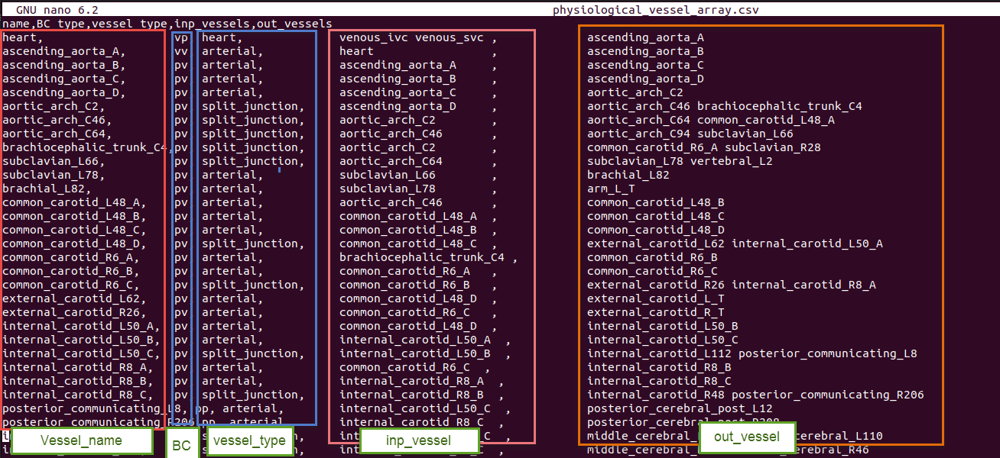
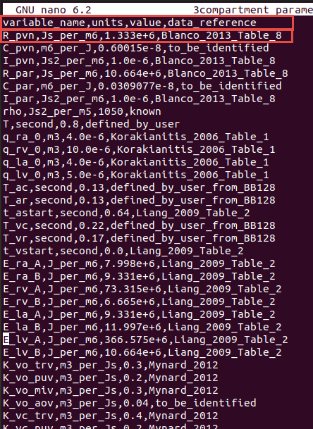
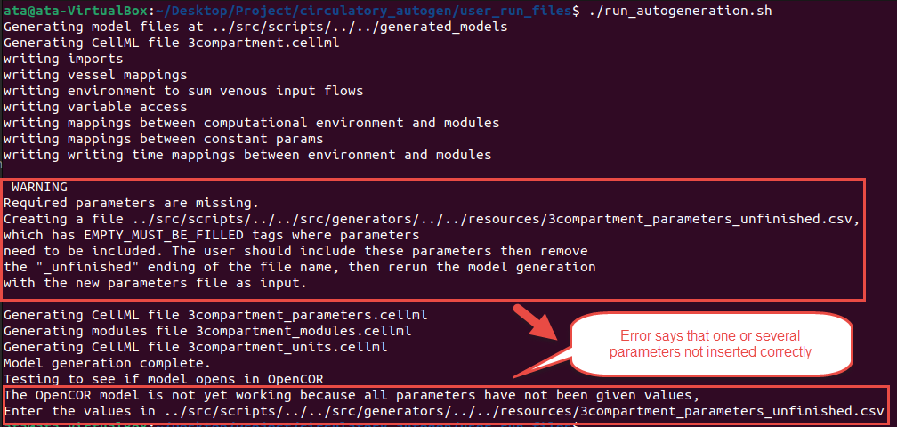
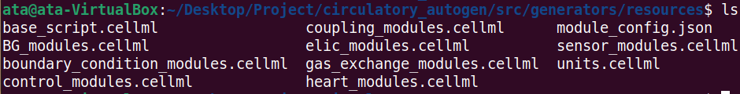
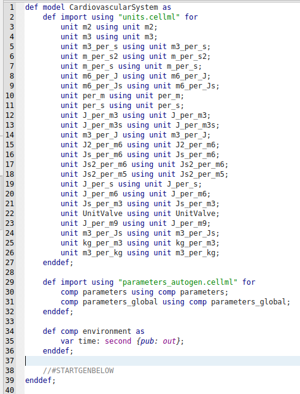
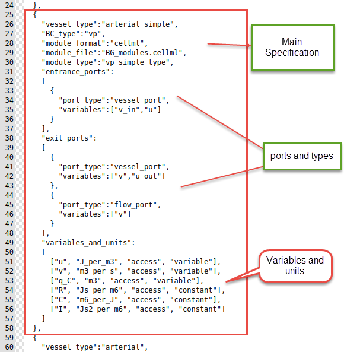
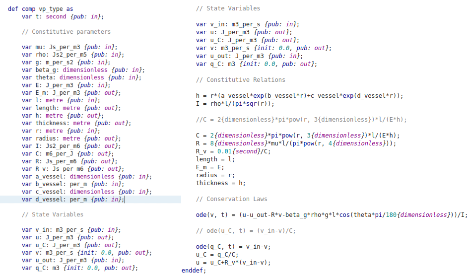
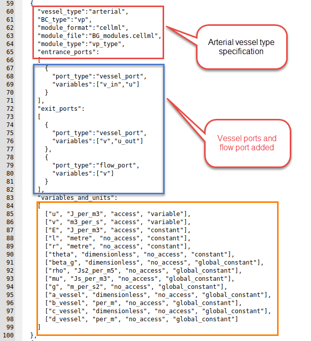

# Creating a new model

This software is designed so the user can easily make their own modules and couple them with existing modules. The steps are as follows.

1. Either choose an existing `{module_category}_modules.cellml` file to write your module, or if it is a new category of module, create a `{module_category}_modules.cellml` file in `src/generators/resources/`.

2. Put you cellml model into the `{module_category}_modules.cellml` file.

3. Create a corresponding module configuration entry into `module_config.json`. These module declarations detail the variables that can be accessed, the constants that must be defined and the available ports of the module.

4. Include your new module into the vessel array file.

    !!! Note
        Modules that are connected as each others inputs and outputs will be coupled together with any ports with corresponding name. 
        
        For an example, if VesselOne has an entrance 'vessel_port' and VesselTwo has an entrance 'vessel_port', they will be coupled with the variables declared in their corresponding 'vessel_port'. You must be careful when making a new module, that the modules it couples to only has matching port types for the ones that are necessary for coupling.

Following sections include more details on creating the above required files.

## Creating vessel_array and parameter files

This section discusses creating a vessel array and parameters files to build a new desired model.

One standard vessel array file contains five important columns as elaborated in the table below. 

- **vessel_name** is the name of a common organ or part of the cardiovascular system.
- **BC_type** is the type of the boundary condition for the vessel's input and output.
- **vessel_type** can be defined as the desired module which exists in the module_config.json file. However, the readily usable vessel_types are possible as shown in the table. 
- **inp_vessel** is the input of each part.
- **out_vessel** is the output of each part.

| Column name    | Possible inputs                                                                                               |
|----------------|---------------------------------------------------------------------------------------------------------------|
| vessel_name    | User defined, but it is better to use common names like 'heart', 'pvn', 'par', etc.                           |
| BC_type        | 'vv', 'vp', 'pv', 'pp', 'pp_wCont', 'pp_wLocal', 'nn' (linked to BC_type in the module_config.json file)      |
| vessel_type    | 'heart', 'arterial', 'arterial_simple', 'venous', 'terminal', 'split_junction', 'merge_junction', '2in2out_junction', 'gas_transport_simple', 'pulomonary_GE', 'baroreceptor', 'chemoreceptor' (linked to vessel_type in the module_config.json file)  |
| inp_vessels    | name of the input vessels, which is one (or more) of the vessel_name entries in the other rows                |
| out_vessel     | name of the output vessels, which is one (or more) of the vessel_name entries in other rows                   |

Below figure is an example of a vessel_array file.

Every row of the vessel array file represents a specific part or module in the defined system. Therefore, each module needs several parameters for modeling and generating a CellML file.

These parameters should be inserted in the parameters file: `[resources_dir]/[file_prefix]_parameters.csv`.

This file has the structure as shown below.

| Column Name    | Description                                       |
|----------------|---------------------------------------------------|
| variable_name  | Parameter name                                    |
| units          | Unit in the defined units in CellML's unit file   |
| value          | Value of parameter                                |
| data_reference | Reference of the parameter value. Typically in [last_name][date][first_word_of_paper] format for papers.  |

Following is an example of a parameter file.

!!! Note
    If you forget to add or insert any needed parameter in the file when you run the code, it shows you this message at the end:

    

    At this time, you should edit the `[resources_dir]/[file_prefix]_parameters_unfinished.csv` file that will have been created.
    
    This file will include the parameters which were not inserted in the file with *EMPTY_MUST_BE_FILLED* value and data_reference entries. You should add the parameter value and a reference in the file. Subsequently, delete the last part of the file's name (“unfinished”) and rerun the code to solve the issue.

## Modules and definition of a new module

In the `[CA_dir]/src/generators/resources` directory, there are several CellML files which contain the modules that can be coupled together in your model. The `module_config.json file` defines the connection ports and variables of each cellml module.

The `base_script.cellml` is the template of the main cellml file that gets generated (shown below). It uses the `units.cellml` in the main generated code to add all types of units. Also, `module_config.json` is the main file used in autogeneration to know how to couple the cellml files in the arrangement defined by the vessel_array file.

If you want to create a new module, you must add the related JSON data in the `module_config.json` and link to the file where the cellml file is contained, e.g. `BG_modules.cellml` or another cellml file in `[CA_dir]/src/generators/resources/`.

As shown in the below figure, there are three different parts for each module. The primary specification includes vessel_type, boundary condition type, and module_file, then the ports and their types, and finally, variables and constants.

Following is one of the modules in the `BG_modules` file. The main body of a specific module contains variables declaration, constitutive parameters, and state variables. Then, you should write the constitutive relations and eventually, ODE equations.

## Example of creating a new module

This section shows a simple example to create a new module, which you can find in the JSON file.

We want to define a new vessel type with the name of **"arterial"** with boundary condition type **"vp"**. Additionally, we want to use the **"vp_type"** module, whose cellml code is shown in the above figure. Also, the module is located in the `BG_modules.cellml` file.

Vessel_type, BC_type, module_format, module_file location, module_type and other related information are added to the `module_config.json` file, as shown below. We can now use this vessel_type in the vessel_array file in `[resources_dir]` to add the module with specified inputs, outputs and parameters. In the ports, you should add the **"vessel_port"** type for connecting to the other parts. Additionally, each module can be used in many vessel_types.

The entries in the `module_config.json` file are detailed as follows:

- **vessel_type**: This will be the "vessel_type" entry in the vessel_array file
- **BC_type**: This will be the "BC_type" entry in the vessel_array file
- **module_format**: Currently only cellml is supported but in the future, cpp modules and others will be allowed.
- **module_file**: The file within `[CA_dir]/src/generators/resources/` that contains the cellml module that this config entry links to.
- **module_type**: The name of the module/computational_environment within the module cellml file.
- **entrance_ports**: Specification of the port types that this module can take if it is connected as an "out_vessel" to another module. If a port_type matches to the port_type of a exit_port in a module coupled as an input, then the port_types variables, e.g. [v_in, u] get mapped to the variables in the coupled modules exit port e.g. [v, u_out].
- **exit_ports**: Specification of the port types that this module can take if it is connected as an "inp_vessel" to another module.
- **port_types**: The name of the type of port. If two vessels are connected vessel_a to vessel_b, and vessel_a has an exit_port with the same port_type as an entrance_port of vessel_b, then a connection will be made. 
- **variables**: These are the variables within the module that will be connected to the variables in the corresponding port of the connected vessel/module.
- **variables_and_units**: This specifies all of the constants and the accesible variables of the cellml module. The entries are:
    - [0] **variable name**: corresponding to the name in the cellml file
    - [1] **variable unit**: corresponsing to the unit specification in `units.cellml`
    - [2] **access or no_access**: whether the variable can be accessed within the cellml simulation. This should always be "access" for accessibility, unless you want to decrease memory usage.
    - [3] **parameter type**: can be constant, global_constant, variable, or boundary_condition.
      - If parameter_type is boundary_condition 

    !!! Note
        All constants are required to be entered in the `[resources_dir]/[file_prefix]_parameters.csv` file with the following naming convention: **[variable_name]_[vessel_name]**.

        All global_constants are required to be entered in the `[resources_dir]/[file_prefix]_parameters.csv` file as just **[variable_name]**.
