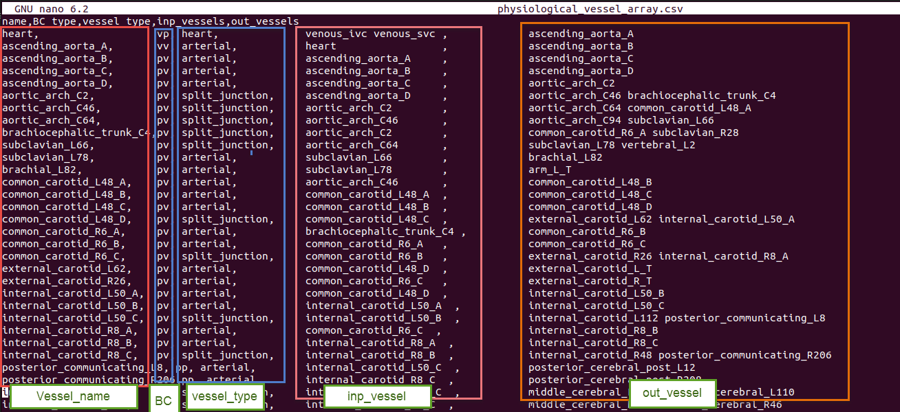
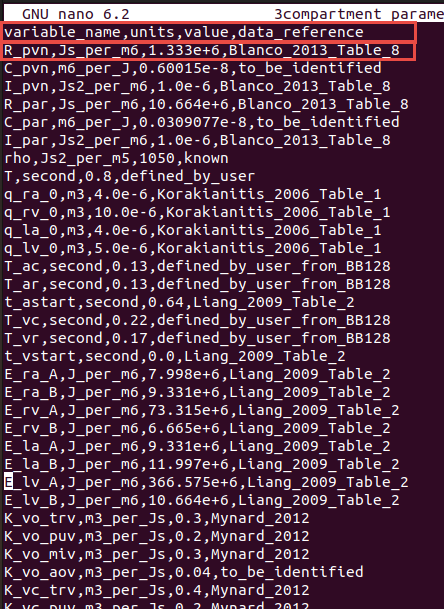
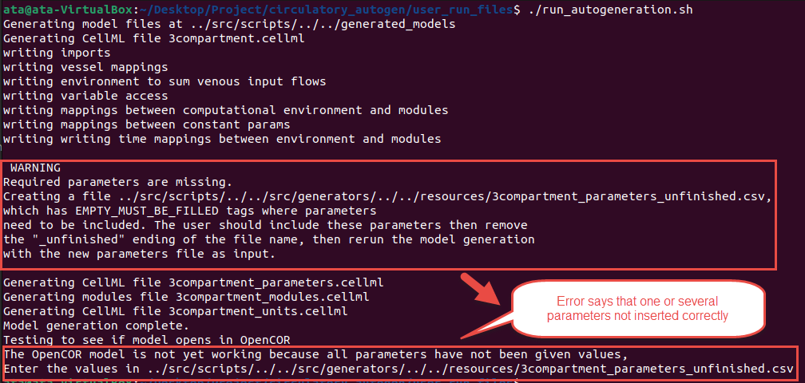
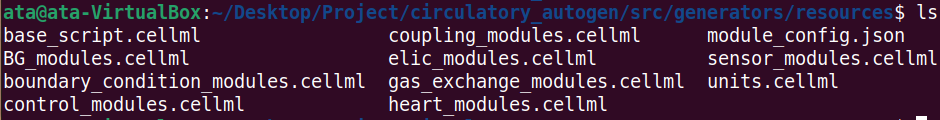
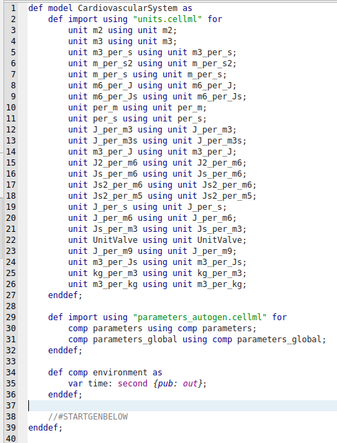
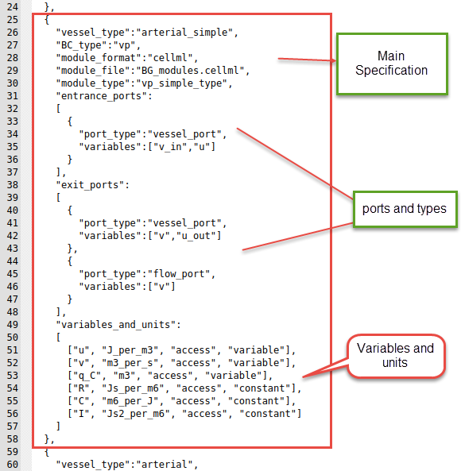
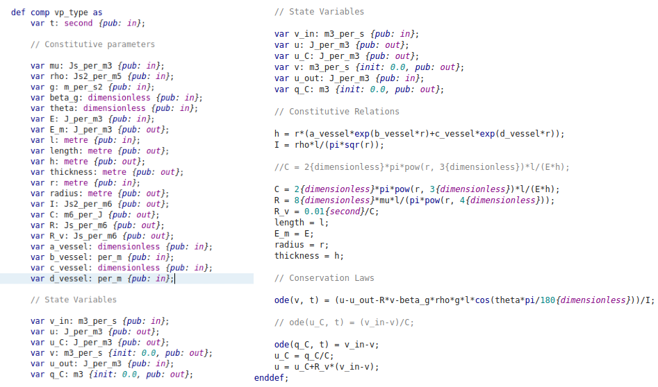
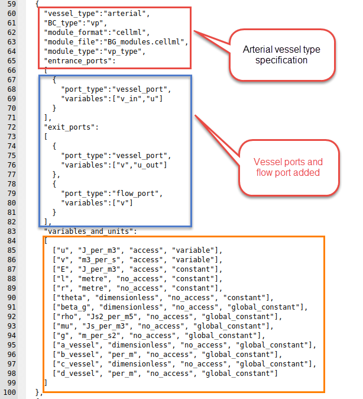

# Designing a model

This section describes how to design a model to be run in Circulatory Autogen. There are two sub sections included in this guide as follows.

1. [Creating a new model](#creating-a-new-model)

2. [Converting an existing CellML model to run in Circulatory Autogen](#converting-an-existing-cellml-model-to-run-in-circulatory-autogen)

## Prerequisites

- Familiarity with your CellML module structure.
- A place to store user modules and configs (`module_config_user/` or an external modules directory).

## Creating a new model

This software is designed so the user can easily make their own modules and couple them with existing modules. The steps are as follows.

1. Either choose an existing `[module_category]_modules.cellml` file to write your module, or if it is a new category of module, create a `[module_category]_modules.cellml` file in `[project_dir]/module_config_user/`.

2. Put your cellml model into the `[module_category]_modules.cellml` file.

3. Create a corresponding module configuration entry in a JSON file within `[project_dir]/module_config_user/`. The code loads all `*.json` files in `module_config_user` (and in `src/libcuflynx/generators/resources`), so you can name it with your category (e.g. `[module_category]_modules_config.json`). These module declarations detail the variables that can be accessed, the constants that must be defined, and the available ports of the module.

4. When possible, use units defined in `[project_dir]/src/libcuflynx/generators/resources/units.cellml`. If you need to define new units, define them in `[project_dir]/module_config_user/user_units.cellml` (or in an external modules directory; see below).

5. Include your new module into a `[CA_user_dir]/[file_prefix]_vessel_array.csv` file.

    !!! Note
        Modules that are connected as each others inputs and outputs will be coupled together with any ports with corresponding name. 
        
        For an example, if VesselOne has an exit_port 'vessel_port' and VesselTwo has an entrance_port 'vessel_port', they will be coupled with the variables declared in their corresponding 'vessel_port'. You must be careful when making a new module, that the modules it couples to only has matching port types for the ones that are necessary for coupling.

        Additionally, if a module has a general_port [port_name], it will couple to any entrance, exit, or general port in a connected vessel with the port name [port_name]. 

        Standard usage: entrance and exit ports are used for spatial connections (e.g. exit to entrance of a parent and daughter vessel), whereas general ports are used for non-spatial connections (e.g a port for a material property of a whole vessel)

6. Define model constants in a `[CA_user_dir]/[file_prefix]_parameters.csv` file. OR run the autogeneration, which will call an error and create a `[CA_user_dir]/[file_prefix]_parameters_unfinished.csv`. See [model generation and simulation](model-generation-simulation.md)

The following sections include more details on creating the above required files.

### Creating vessel_array and parameter files

This section discusses creating a vessel_array and parameters files to build a new desired model.

One standard vessel array file contains five important columns as elaborated in the table below. 

- **vessel_name** is the name of a common organ or part of the cardiovascular system.
- **BC_type** is the type of the boundary condition for the vessel's input and output or more generally, the subtype of the module.
- **vessel_type** can be defined as the desired module which exists in the `[project_dir]/src/libcuflynx/generators/resources/*_modules_config.json` files or one of the `[project_dir]/module_config_user/*_config.json` files. 
- **inp_vessel** is the input of each part.
- **out_vessel** is the output of each part.

Some examples of possible inputs

| Column name    | Possible inputs                                                                                               |
|----------------|---------------------------------------------------------------------------------------------------------------|
| vessel_name    | User defined, but it is better to use common names like 'heart', 'pvn', 'par', etc.                           |
| BC_type        | 'vv', 'vp', 'pv', 'pp', 'pp_wCont', 'pp_wLocal', 'nn' (linked to BC_type in the modules config JSON files)      |
| vessel_type    | 'heart', 'arterial', 'arterial_simple', 'venous', 'terminal', 'split_junction', 'merge_junction', '2in2out_junction', 'gas_transport_simple', 'pulomonary_GE', 'baroreceptor', 'chemoreceptor' (linked to vessel_type in the modules config JSON files)  |
| inp_vessels    | name of the input vessels, which is one (or more) of the vessel_name entries in the other rows                |
| out_vessel     | name of the output vessels, which is one (or more) of the vessel_name entries in other rows                   |

The vessel array can also be in the layout of PhLynx's "Circulatory Autogen" export, with the columns `name, module_type, module_subtype, inp_instances, out_instances`. There `module_type` is the vessel_type, `module_subtype` the BC_type, and `inp_instances`/`out_instances` the inp_vessels/out_vessels. The layout is detected from the header. A header that mixes the two layouts is an error.

#### JSON vessel arrays

The vessel array can also be a JSON file, `[file_prefix]_vessel_array.json`: a list of records, one per module instance.

```json
[
 {"name": "src", "module_type": "flow_src", "module_subtype": "nn", "inp_instances": [], "out_instances": ["coll"]},
 {"name": "coll", "module_type": "collector", "module_subtype": "nn", "inp_instances": ["src"], "out_instances": []}
]
```

A record uses PhLynx's keys, as above, or the libcuflynx keys `name, vessel_type, BC_type, inp_vessels, out_vessels`. A record that mixes the two is an error. `name` and the type and subtype are required. The input and output lists are optional JSON lists; a space-separated string is accepted too. Other keys are allowed, and keys holding plain values become extra columns, as extra CSV columns do.

A CSV vessel array is read by converting each row to this record first, so a CSV and its JSON conversion generate byte-identical models. The generator looks for the vessel array in this order: `[file_prefix]_vessel_array.json`, `[file_prefix]_vessel_array.csv`, then PhLynx's `[file_prefix]_module_array.json` and `[file_prefix]_module_array.csv`.

To convert CSV arrays, run

```bash
python -m libcuflynx.utilities.config_schemas to-json resources/my_model_vessel_array.csv [more.csv ...] [--style phlynx|libcuflynx]
```

This writes `my_model_vessel_array.json` next to each CSV, one record per line. The default style is PhLynx's keys. From Python, use `libcuflynx.utilities.config_schemas.vessel_array_to_json(csv_path, json_path=None, style="phlynx")`, and `read_vessel_array_records(path)` to read either form as records.

JSON Schemas for the vessel array and for module config files ship with the package, in `libcuflynx/schemas/`: `vessel_array.schema.json` and `module_config.schema.json`. Editors and other tools can use them to validate the files. The generator checks the same rules itself, and its errors name the file, the record index and the key.

Below figure is an example of a vessel_array file.



Every row of the vessel array file represents a specific part or module in the defined system. Therefore, each module needs several parameters for modeling and generating a CellML file.

These parameters should be inserted in the parameters file: `[resources_dir]/[file_prefix]_parameters.csv`.

This file has the structure as shown below.

| Column Name    | Description                                       |
|----------------|---------------------------------------------------|
| variable_name  | Parameter name                                    |
| units          | Unit in the defined units in CellML's unit file   |
| value          | Value of parameter                                |
| data_reference | Reference of the parameter value. Typically in `[last_name][date][first_word_of_paper]` format for papers.  |

The following is an example of a parameter file.



!!! Note
    If you forget to add or insert any needed parameter in the file when you run the code, it shows you this message at the end:

    

    At this time, you should open the `[resources_dir]/[file_prefix]_parameters_unfinished.csv`, which will include the parameters which were not inserted in the file with *EMPTY_MUST_BE_FILLED* value and data_reference entries. You should add the parameter value and reference, then copy the line to the original [file_prefix].csv file. Or you can add the value in the _unfinished.csv file then remove the last part of the file's name (“_unfinished”) (overwriting the original) and rerun the code with the correctly set parameters.

### Modules and definition of a new module

In the `[CA_dir]/src/libcuflynx/generators/resources` directory, there are several CellML files which contain the modules that can be coupled together in your model. Each module file has a corresponding `*_modules_config.json` file that defines connection ports and variables. Additionally, CellML and JSON files in `module_config_user` contain extra modules you define locally.



<!-- The `base_script.cellml` is the template of the main cellml file that gets generated (shown below). It uses the `units.cellml` in the main generated code to add all types of units. Also, the modules config JSON files are used in autogeneration to know how to couple the cellml files in the arrangement defined by the vessel_array file. -->
<!--  -->
<!--  -->

If you want to create a new module, create or add to a `module_config_user/[module_category]_modules.cellml` file and a matching JSON config file (e.g. `module_config_user/[module_category]_modules_config.json`). You can also keep these files outside the repo by setting `external_modules_dir` in your `user_inputs.yaml` to a directory containing `*_modules.cellml`, `*_modules_config.json`, and optionally any `*units.cellml` files (e.g. `user_units.cellml`).

To use a module library laid out one module per directory (for example [circulatory-autogen-modules](https://github.com/physiomelinks/circulatory-autogen-modules)), set `module_library_dirs` to one or more directories. Each one is searched recursively for `*_modules.cellml`, `*_modules_config.json` (or `*_module_config.json`) and `*units.cellml` files; other JSON files, such as parameter or obs_data files kept next to a module, are ignored. Set `use_builtin_modules: false` to use only external modules. The built-in and `module_config_user` modules are then not loaded, so a library can define its own version of a built-in `(vessel_type, BC_type)`. Units defined identically in several files are written once; a unit defined differently in two files is an error.

```yaml
module_library_dirs:
  - /path/to/circulatory-autogen-modules/modules
use_builtin_modules: false
```

As shown in the below figure, there are three different parts for each module: the primary specification (vessel_type, boundary condition type, module_file), then the ports and their types, and finally, variables and constants.



Following is one of the modules in the `BG_modules` file. The main body of a specific module contains variables declaration, constitutive parameters, and state variables. Then, the constitutive relations and eventually, ODE equations.



### Example of creating a new module

This section shows a simple example to create a new module

We want to define a new vessel type with the name of **"arterial"** with boundary condition type **"vp"**. Additionally, we want to use the **"vp_type"** module, whose cellml code is shown in the above figure. Also, the module is located in the `BG_modules.cellml` file.

Vessel_type, BC_type, module_format, module_file location, module_type and other related information are added to the modules config JSON file, as shown below. We can now use this vessel_type in the vessel_array file in `[resources_dir]` to add the module with specified inputs, outputs and parameters. In the ports, you should add the **"vessel_port"** type for connecting to the other parts. Additionally, each module can be used in many vessel_types.



The entries in the module config JSON file are detailed as follows.

A module config entry can also use PhLynx's key names. The generator detects the schema of each entry separately, so one library can use both, even within one file:

| libcuflynx      | PhLynx            | meaning                                          |
|-----------------|-------------------|--------------------------------------------------|
| `vessel_type`   | `module_type`     | the name used in the vessel array's type column  |
| `BC_type`       | `module_subtype`  | the boundary-condition variant                   |
| `module_file`   | `component_file`  | the CellML file that holds the module            |
| `module_type`   | `component_type`  | the name of the CellML component                 |

`module_type` means different things in the two schemas. So an entry is read as PhLynx's schema when it has `module_subtype`, `component_file` or `component_type`, never because of `module_type`. An entry that mixes keys from both schemas, or a PhLynx entry that is missing one of its four keys, stops the generation with an error. The remaining keys (`module_format`, the ports and `variables_and_units`) are the same in both schemas.

- **vessel_type**: This will be the "vessel_type" entry in the vessel_array file
- **BC_type**: This will be the "BC_type" entry in the vessel_array file
- **module_format**: Currently only cellml is supported but in the future, cpp modules and others will be allowed.
- **module_file**: The file within `[CA_dir]/src/libcuflynx/generators/resources/`, `[CA_dir]/module_config_user/`, or your `external_modules_dir` that contains the CellML module this config entry links to.
- **module_type**: The name of the module/computational_environment within the module cellml file.
- **entrance_ports**: Specification of the port types that this module can take if it is connected as an "out_vessel" to another module. If a port_type matches to the port_type of a exit_port in a module coupled as an input, then the port_types variables, e.g. [v_in, u] get mapped to the variables in the coupled modules exit port e.g. [v, u_out].
- **exit_ports**: Specification of the port types that this module can take if it is connected as an "inp_vessel" to another module.
- **general_ports**: Specification of the port types that this module can take if it is connected as any type of connection to another module. Port entries are:
    - **port_types**: The name of the type of port. If two vessels are connected vessel_a to vessel_b, and vessel_a has an exit_port with the same port_type as an entrance_port of vessel_b, then a connection will be made. 
    - **variables**: These are the variables within the module that will be connected to the variables in the corresponding port of the connected vessel/module.
    !!! Note 
        If you want a port variable to be able to couple to multiple other modules, set `"multi_port": "True"` in the entrance, exit, or general port. `"multi_port": "sum"` is used for variables that take in multiple port variables and sum them to equal this variable.
    - **multi_port** (optional): lets one port connect to several modules. Its values are case-insensitive: `"sum"`, `"Sum"` and `"SUM"` are the same. It is either a string that applies to the whole port, or a list with one entry per port variable (below). The string forms are:
        - `"True"`: this module's port variables are mapped to the corresponding variables of every connected module.
        - `"sum"` on a port whose `port_type` is `volume_port`: the port's variable is the total of the connected modules' volumes, computed in the `sum_blood_volume` component.
        - `"sum"` on any other port: the port must have exactly one variable. That variable is the sum, over every module connected through the port, of the neighbour's corresponding variable. This is the same as the list form `["sum"]`, described below. It is what PhLynx's `"Sum"` means. For example, the module library's `microvasculature_network` Nout modules have an exit `flow_port` `[v_out_sum]` with `"Sum"`, so `v_out_sum` is the sum of the downstream modules' inflows. As in the list form, the sum is positive on both entrance and exit ports, and only one side of a connection may sum.
        - `"Multiply"`: the port must have exactly one variable. On the upstream side of a connection (an exit or general port of the module that lists the neighbour in its `out_vessels`), each connected module's corresponding variable is set to `multiply_factor` times this module's variable. The generated component that does this is `multiport_multiply_[neighbour_name]_[neighbour_variable]`. If the neighbour's port is a `"sum"`, the scaled value is added as one term of its sum instead. On the downstream side of a connection, a `"Multiply"` port is mapped like `"True"`. This matches PhLynx.
    - **multiply_factor** (optional, number, default 1): the factor of a `"Multiply"` port, e.g. `{"port_type": "gain_port", "variables": ["x"], "multi_port": "Multiply", "multiply_factor": 2.5}`. PhLynx keeps this factor in its user interface, not in the config file, so add it to a PhLynx-exported config by hand. It is an error on a port that is not `"Multiply"`.
    - **multi_port** as a **list with one entry per port variable**, aligned with `variables`, when some variables must be summed over the connected modules and others shared with them:

        ```json
        {"port_type": "vessel_port", "variables": ["v_in", "u"], "multi_port": ["sum", "True"]}
        ```

        - `"sum"`: this module's variable (an input of the module) equals the sum, over every module connected through this port, of that module's corresponding port variable, i.e. the variable at the same position in its matching port, which a plain one-to-one mapping would have paired it with. The sum is computed in a generated algebraic component, `multiport_sum_[vessel_name]_[variable_name]`, declared in the units of this module's variable. A neighbour variable in different but compatible units (e.g. `mm3_per_s` summed into `m3_per_s`) is scaled; incompatible units stop the generation with an error. If no module is connected through the port, the variable is set to 0 and a warning is printed, and no `[variable_name]_[vessel_name]` parameter is needed for it.
        - `"True"`: this module's variable is mapped to the corresponding variable of **every** connected module. It is normally an output of this module (one source, many sinks).

        A list-form port works as an entrance port (many upstream modules), an exit port (many downstream modules) or a general port. With one connected module it behaves exactly like a plain port. For example, a `flow_merge` node (many inflows, one outflow) has the entrance port above, `[v_in, u]` with `["sum", "True"]`, and a plain exit port `[v_out, u_d]`, with `v_out = v_in` and `u = u_d`: the node's inflow is the sum of the upstream flows, and every upstream module reads the node pressure. A `flow_split` node (one inflow, many outflows) puts the list on its exit port instead, `[v_out, u_d]` with `["sum", "True"]`. Only one side of a connection may mark a variable `"sum"`. List-form ports are not supported when coupling a C++ model to a 1D model (`couple_to_1d`); generation raises `NotImplementedError` there.
- **variables_and_units**: This specifies all of the constants and the accesible variables of the cellml module. The entries are:
    - [0] **variable name**: corresponding to the name in the cellml file
    - [1] **variable unit**: corresponsing to the unit specification in `units.cellml`
    - [2] **access or no_access**: whether the variable can be accessed within the cellml simulation. This should always be "access" for accessibility, unless you want to decrease memory usage.
    - [3] **parameter type**: can be constant, global_constant, variable, or boundary_condition.
      - If parameter_type is boundary_condition it will be set to a variable accesses from another module if the corresponding port is connected. However, if the 
        corresponding port is not connected, the boundary_condition will be set to a constant, and required to be set in the `[resources_dir]/[file_prefix]_parameters.csv` file 

    !!! Note
        All constants are required to be entered in the `[resources_dir]/[file_prefix]_parameters.csv` file with the following naming convention: **[variable_name]_[vessel_name]**.

        All global_constants are required to be entered in the `[resources_dir]/[file_prefix]_parameters.csv` file as just **[variable_name]**.

### Supermodules

A supermodule is a named group of modules that a vessel array uses like one module. It is an entry in a `*_modules_config.json` file, in a directory listed in `module_library_dirs` (or in `external_modules_dir`):

```json
{"module_type": "heart", "module_subtype": "supermodule", "module_format": "supermodule",
 "description": "four chambers, four valves and a cardiac clock",
 "submodules": [
   {"name": "clock", "module_type": "cardiac_clock", "module_subtype": "nn", "inp_instances": [], "out_instances": ["ra", "rv", "la", "lv"]},
   {"name": "ra", "module_type": "chamber", "module_subtype": "vv", "inp_instances": ["clock"], "out_instances": ["trv"]}
 ],
 "default_parameters": "heart_parameters.csv"}
```

- **module_type / module_subtype** (or **vessel_type / BC_type**): the type that instances name in a vessel array.
- **module_format**: `"supermodule"`. A supermodule has no `component_file`/`component_type`; it is never a component module, and its type may not also be a component module's type.
- **submodules**: vessel-array records, in either key style. Their names are local to the supermodule, and their input and output lists name other submodules only.
- **default_parameters** (optional): a parameters CSV, relative to the config file's directory, with the usual `variable_name,units,value,data_reference` columns. A row named `[variable]_[submodule]` is a parameter of that submodule; any other row is a global.
- **description** (optional).

An instance in a vessel array names the supermodule's type and links its hosts, the modules outside it, to individual submodules:

```json
{"name": "heart", "module_type": "heart", "module_subtype": "supermodule",
 "per_submodule_inputs": {"ra": ["venous_svc"], "la": ["pvn"]},
 "per_submodule_outputs": {"aov": ["aortic_root"], "puv": ["par"]}}
```

`per_submodule_inputs` lists, for a submodule, the hosts that feed it; each of those hosts lists the instance (`heart`) in its outputs. `per_submodule_outputs` lists the hosts a submodule feeds; each of those lists the instance in its inputs. Either may also be written as a list of one-key objects, `[{"ra": ["venous_svc"]}, {"la": ["pvn"]}]`.

Before anything else reads the vessel array, each instance is replaced, at its position, by one record per submodule:

- submodule `ra` becomes `heart_ra`, and its links to other submodules are prefixed the same way;
- the hosts in `per_submodule_inputs["ra"]` come first in `heart_ra`'s inputs, and the hosts in `per_submodule_outputs["ra"]` last in its outputs;
- in a host, the instance name is replaced, in place, by every `heart_[submodule]` that the instance links it to.

So parameters and outputs are named after the expanded modules, e.g. `E_heart_lv`, `heart_lv/q`. The default parameters are renamed in the same way (`[variable]_[submodule]` becomes `[variable]_[instance]_[submodule]`; the suffix is matched against the submodule names, longest first). They are used for every name that `[file_prefix]_parameters.csv` does not set, so values in your parameters file always win. A global used by several instances is added once.

A submodule can itself be a supermodule instance, with its own `per_submodule_inputs`/`per_submodule_outputs` naming its siblings; it is expanded in turn. A supermodule that contains itself, directly or through others, is an error.

Expansion stops with an error that names the file, the instance and the key when a `per_submodule_*` names a submodule that does not exist, or a host that does not exist or does not list the instance back; when a module lists the instance but no `per_submodule_*` entry links them; when an expanded name is already in the array; or when no supermodule of the instance's type was found. An instance named `heart` is not treated as the legacy `heart` module: after expansion there is no module called `heart`.

## Converting an existing CellML model to run in Circulatory Autogen

Circulatory Autogen provides a script to convert an existing CellML model (with parameters hardcoded in the modules) to a format that can be used with Circulatory_Autogen. This format defines parameters in a separate file so they can be used for calibration and specifies modules in a config file with ports for easy coupling.
You can find the script **"generate_modules_files.py"** at `[CA_dir]/src/libcuflynx/scripts`.

Update the script to change the `input_model` variable to the path of your CellML model and `output_dir` variable to the directory where you need to create the resources files and the new `[file_prefix]_user_inputs.yaml` file.

This script generates `[file_prefix]_modules.cellml` and `[file_prefix]_module_config.json` in the `module_config_user` directory. `[file_prefix]_parameters.csv` and `[file_prefix]_vessel_array.csv` files are created in `[output_dir]/resources` and `[file_prefix]_user_inputs.yaml` is created in `[output_dir]`.

You only need to update the `user_inputs.yaml` file at the `user_run_files` directory to set **`user_inputs_path_override:`** to `[output_dir]/[file_prefix]_user_inputs.yaml` to run model autogeneration.

!!! Note
    You can update the **file_prefix**, **vessel_name** and the **data_reference** variables in the `generate_modules_files.py` at the `src/libcuflynx/scripts` directory before running the script, so it will generate files with the defined variables.

!!! Warning
    You need to specify the variable name of time as the **time_variable**.

    Variable **component_name** should be the name of the component for which you want to generate files.

## Expected outcome

You should have:

- A `*_modules.cellml` file and a matching modules config JSON.
- Updated `*_vessel_array.csv` and `*_parameters.csv` files referencing your modules.
- A `user_inputs.yaml` file that points to your resources directory.

