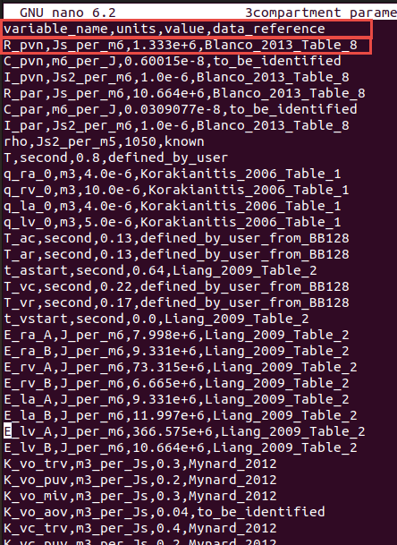
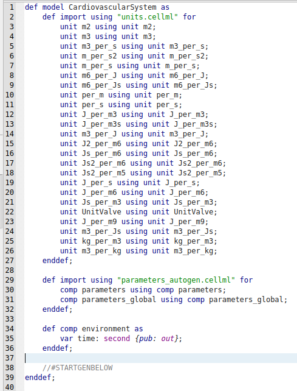
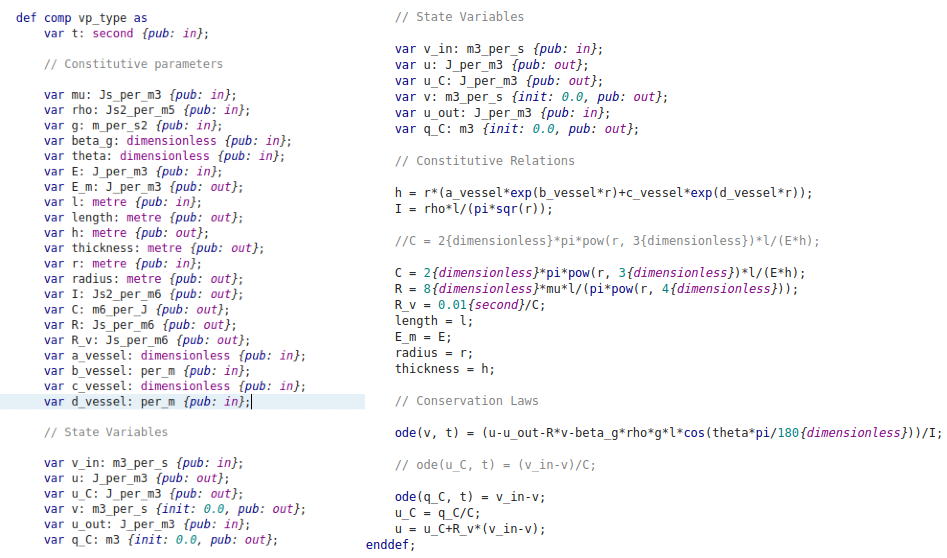
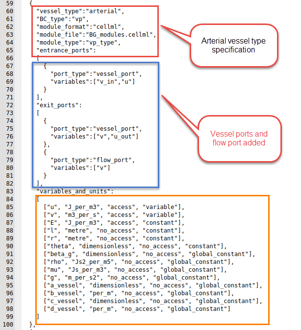

# Designing a model

This section describes how to design a model to be run in Circulatory Autogen. There are two sub sections included in this guide as follows.

1. [Creating a new model](#creating-a-new-model)

2. [Converting an existing CellML model to run in Circulatory Autogen](#converting-an-existing-cellml-model-to-run-in-circulatory-autogen)

## Prerequisites

- Familiarity with your CellML module structure.
- A place to store user modules and configs (`module_config_user/` or an external modules directory).

## Creating a new model

This software is designed so the user can easily make their own modules and couple them with existing modules. The steps are as follows.

1. Either choose an existing `[module_category]_modules.cellml` file to write your module, or if it is a new category of module, create a `[module_category]_modules.cellml` file in `[project_dir]/module_config_user/`.

2. Put your cellml model into the `[module_category]_modules.cellml` file.

3. Create a corresponding module configuration entry in a JSON file within `[project_dir]/module_config_user/`. The code loads all `*.json` files in `module_config_user` (and in `src/generators/resources`), so you can name it with your category (e.g. `[module_category]_modules_config.json`). These module declarations detail the variables that can be accessed, the constants that must be defined, and the available ports of the module.

4. When possible, use units defined in `[project_dir]/src/generators/resources/units.cellml`. If you need to define new units, define them in `[project_dir]/module_config_user/user_units.cellml` (or in an external modules directory; see below).

5. Include your new module into a `[CA_user_dir]/[file_prefix]_vessel_array.csv` file.

    !!! Note
        Modules that are connected as each others inputs and outputs will be coupled together with any ports with corresponding name. 
        
        For an example, if VesselOne has an exit_port 'vessel_port' and VesselTwo has an entrance_port 'vessel_port', they will be coupled with the variables declared in their corresponding 'vessel_port'. You must be careful when making a new module, that the modules it couples to only has matching port types for the ones that are necessary for coupling.

        Additionally, if a module has a general_port [port_name], it will couple to any entrance, exit, or general port in a connected vessel with the port name [port_name]. 

        Standard usage: entrance and exit ports are used for spatial connections (e.g. exit to entrance of a parent and daughter vessel), whereas general ports are used for non-spatial connections (e.g a port for a material property of a whole vessel)

6. Define model constants in a `[CA_user_dir]/[file_prefix]_parameters.csv` file. OR run the autogeneration, which will call an error and create a `[CA_user_dir]/[file_prefix]_parameters_unfinished.csv`. See [model generation and simulation](model-generation-simulation.md)

The following sections include more details on creating the above required files.

### Creating vessel_array and parameter files

This section discusses creating a vessel_array and parameters files to build a new desired model.

One standard vessel array file contains five important columns as elaborated in the table below. 

- **vessel_name** is the name of a common organ or part of the cardiovascular system.
- **BC_type** is the type of the boundary condition for the vessel's input and output or more generally, the subtype of the module.
- **vessel_type** can be defined as the desired module which exists in the `[project_dir]/src/generators/resources/*_modules_config.json` files or one of the `[project_dir]/module_config_user/*_config.json` files. 
- **inp_vessel** is the input of each part.
- **out_vessel** is the output of each part.

Some examples of possible inputs

| Column name    | Possible inputs                                                                                               |
|----------------|---------------------------------------------------------------------------------------------------------------|
| vessel_name    | User defined, but it is better to use common names like 'heart', 'pvn', 'par', etc.                           |
| BC_type        | 'vv', 'vp', 'pv', 'pp', 'pp_wCont', 'pp_wLocal', 'nn' (linked to BC_type in the modules config JSON files)      |
| vessel_type    | 'heart', 'arterial', 'arterial_simple', 'venous', 'terminal', 'split_junction', 'merge_junction', '2in2out_junction', 'gas_transport_simple', 'pulomonary_GE', 'baroreceptor', 'chemoreceptor' (linked to vessel_type in the modules config JSON files)  |
| inp_vessels    | name of the input vessels, which is one (or more) of the vessel_name entries in the other rows                |
| out_vessel     | name of the output vessels, which is one (or more) of the vessel_name entries in other rows                   |

Below figure is an example of a vessel_array file.

Every row of the vessel array file represents a specific part or module in the defined system. Therefore, each module needs several parameters for modeling and generating a CellML file.

These parameters should be inserted in the parameters file: `[resources_dir]/[file_prefix]_parameters.csv`.

This file has the structure as shown below.

| Column Name    | Description                                       |
|----------------|---------------------------------------------------|
| variable_name  | Parameter name                                    |
| units          | Unit in the defined units in CellML's unit file   |
| value          | Value of parameter                                |
| data_reference | Reference of the parameter value. Typically in [last_name][date][first_word_of_paper] format for papers.  |

The following is an example of a parameter file.

!!! Note
    If you forget to add or insert any needed parameter in the file when you run the code, it shows you this message at the end:

    

    At this time, you should open the `[resources_dir]/[file_prefix]_parameters_unfinished.csv`, which will include the parameters which were not inserted in the file with *EMPTY_MUST_BE_FILLED* value and data_reference entries. You should add the parameter value and reference, then copy the line to the original [file_prefix].csv file. Or you can add the value in the _unfinished.csv file then remove the last part of the file's name (“_unfinished”) (overwriting the original) and rerun the code with the correctly set parameters.

### Modules and definition of a new module

In the `[CA_dir]/src/generators/resources` directory, there are several CellML files which contain the modules that can be coupled together in your model. Each module file has a corresponding `*_modules_config.json` file that defines connection ports and variables. Additionally, CellML and JSON files in `module_config_user` contain extra modules you define locally.

<!-- The `base_script.cellml` is the template of the main cellml file that gets generated (shown below). It uses the `units.cellml` in the main generated code to add all types of units. Also, the modules config JSON files are used in autogeneration to know how to couple the cellml files in the arrangement defined by the vessel_array file. -->
<!--  -->
<!--  -->

If you want to create a new module, create or add to a `module_config_user/[module_category]_modules.cellml` file and a matching JSON config file (e.g. `module_config_user/[module_category]_modules_config.json`). You can also keep these files outside the repo by setting `external_modules_dir` in your `user_inputs.yaml` to a directory containing `*_modules.cellml`, `*_modules_config.json`, and optionally `user_units.cellml`.

As shown in the below figure, there are three different parts for each module: the primary specification (vessel_type, boundary condition type, module_file), then the ports and their types, and finally, variables and constants.

Following is one of the modules in the `BG_modules` file. The main body of a specific module contains variables declaration, constitutive parameters, and state variables. Then, the constitutive relations and eventually, ODE equations.

### Example of creating a new module

This section shows a simple example to create a new module

We want to define a new vessel type with the name of **"arterial"** with boundary condition type **"vp"**. Additionally, we want to use the **"vp_type"** module, whose cellml code is shown in the above figure. Also, the module is located in the `BG_modules.cellml` file.

Vessel_type, BC_type, module_format, module_file location, module_type and other related information are added to the modules config JSON file, as shown below. We can now use this vessel_type in the vessel_array file in `[resources_dir]` to add the module with specified inputs, outputs and parameters. In the ports, you should add the **"vessel_port"** type for connecting to the other parts. Additionally, each module can be used in many vessel_types.

The entries in the module config JSON file are detailed as follows:

- **vessel_type**: This will be the "vessel_type" entry in the vessel_array file
- **BC_type**: This will be the "BC_type" entry in the vessel_array file
- **module_format**: Currently only cellml is supported but in the future, cpp modules and others will be allowed.
- **module_file**: The file within `[CA_dir]/src/generators/resources/`, `[CA_dir]/module_config_user/`, or your `external_modules_dir` that contains the CellML module this config entry links to.
- **module_type**: The name of the module/computational_environment within the module cellml file.
- **entrance_ports**: Specification of the port types that this module can take if it is connected as an "out_vessel" to another module. If a port_type matches to the port_type of a exit_port in a module coupled as an input, then the port_types variables, e.g. [v_in, u] get mapped to the variables in the coupled modules exit port e.g. [v, u_out].
- **exit_ports**: Specification of the port types that this module can take if it is connected as an "inp_vessel" to another module.
- **general_ports**: Specification of the port types that this module can take if it is connected as any type of connection to another module. Port entries are:
    - **port_types**: The name of the type of port. If two vessels are connected vessel_a to vessel_b, and vessel_a has an exit_port with the same port_type as an entrance_port of vessel_b, then a connection will be made. 
    - **variables**: These are the variables within the module that will be connected to the variables in the corresponding port of the connected vessel/module.
    !!! Note 
        If you want a port variable to be able to couple to multiple other modules, set `"multi_port": "True"` in the entrance, exit, or general port. `"multi_port": "sum"` is used for variables that take in multiple port variables and sum them to equal this variable.
- **variables_and_units**: This specifies all of the constants and the accesible variables of the cellml module. The entries are:
    - [0] **variable name**: corresponding to the name in the cellml file
    - [1] **variable unit**: corresponsing to the unit specification in `units.cellml`
    - [2] **access or no_access**: whether the variable can be accessed within the cellml simulation. This should always be "access" for accessibility, unless you want to decrease memory usage.
    - [3] **parameter type**: can be constant, global_constant, variable, or boundary_condition.
      - If parameter_type is boundary_condition it will be set to a variable accesses from another module if the corresponding port is connected. However, if the 
        corresponding port is not connected, the boundary_condition will be set to a constant, and required to be set in the `[resources_dir]/[file_prefix]_parameters.csv` file 

    !!! Note
        All constants are required to be entered in the `[resources_dir]/[file_prefix]_parameters.csv` file with the following naming convention: **[variable_name]_[vessel_name]**.

        All global_constants are required to be entered in the `[resources_dir]/[file_prefix]_parameters.csv` file as just **[variable_name]**.

## Converting an existing CellML model to run in Circulatory Autogen

Circulatory Autogen provides a script to convert an existing CellML model (with parameters hardcoded in the modules) to a format that can be used with Circulatory_Autogen. This format defines parameters in a separate file so they can be used for calibration and specifies modules in a config file with ports for easy coupling.
You can find the script **"generate_modules_files.py"** at `[CA_dir]/src/scripts`.

Update the script to change the `input_model` variable to the path of your CellML model and `output_dir` variable to the directory where you need to create the resources files and the new `[file_prefix]_user_inputs.yaml` file.

This script generates `[file_prefix]_modules.cellml` and `[file_prefix]_module_config.json` in the `module_config_user` directory. `[file_prefix]_parameters.csv` and `[file_prefix]_vessel_array.csv` files are created in `[output_dir]/resources` and `[file_prefix]_user_inputs.yaml` is created in `[output_dir]`.

You only need to update the `user_inputs.yaml` file at the `user_run_files` directory to set **`user_inputs_path_override:`** to `[output_dir]/[file_prefix]_user_inputs.yaml` to run model autogeneration.

!!! Note
    You can update the **file_prefix**, **vessel_name** and the **data_reference** variables in the `generate_modules_files.py` at the `src/scripts` directory before running the script, so it will generate files with the defined variables.

!!! Warning
    You need to specify the variable name of time as the **time_variable**.

    Variable **component_name** should be the name of the component for which you want to generate files.

## Expected outcome

You should have:

- A `*_modules.cellml` file and a matching modules config JSON.
- Updated `*_vessel_array.csv` and `*_parameters.csv` files referencing your modules.
- A `user_inputs.yaml` file that points to your resources directory.

