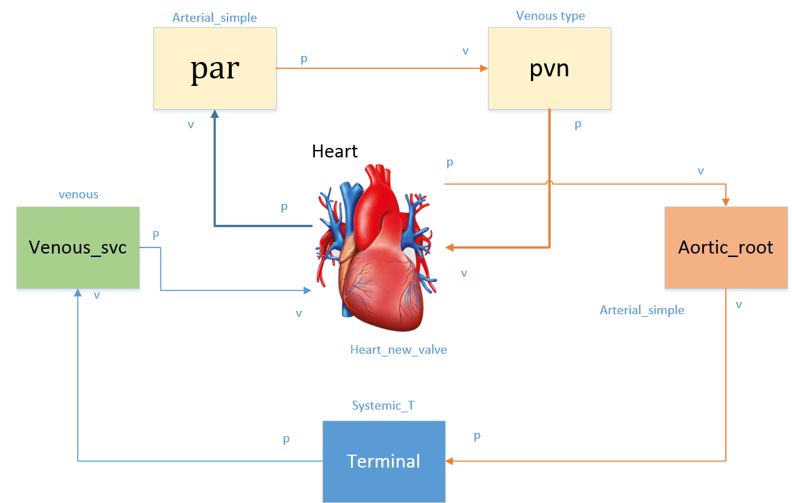
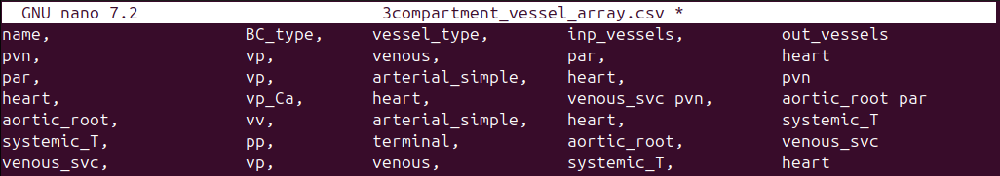
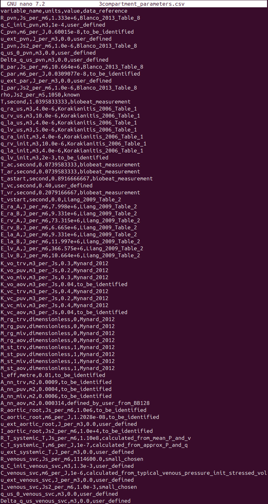
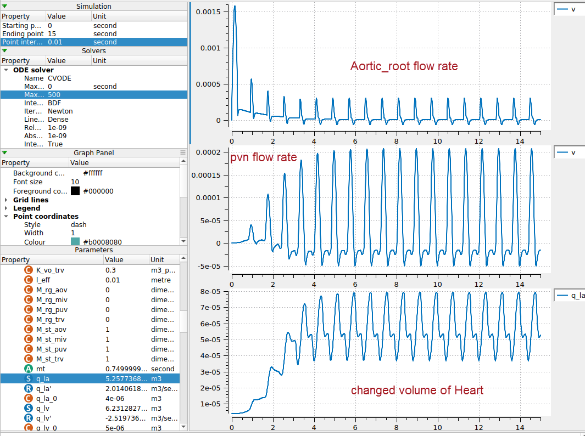

# Example: 3Compartment Model

A schematic view of this model is shown above with details of boundary conditions, parts' names, vein connection, and direction of blood flow through. The heart is modeled as a simple valve module in this example. According to this schematic, the vessel and parameters files are designed as shown in below figures.

In the `vessel_array` file, there are five columns: **name**, **BC_type**, **vessel_type**, **inp_vessels**, and **out_vessels**. 

**name** is the user-chosen module's name, for example *"heart"* or *"aortic_root"*. 

**BC_type** is the boundary condition type for circulatory system vessels. The BC of vessel modules should be one of the *"vv"*, *"vp"*, *"pv"*, and *"pp"* types. The first letter defines input pressure (p) or flow (v) boundary condition, the second letter defines output pressure (p) or flow (v) boundary condition. For example the pulmonary vein (pvn) in the above example has a vp BC type, meaning it has input flow and output pressure boundary conditions.

!!! info
    A vessel with "output flow" BC must be connected to a vessel with "input pressure" BC and vice versa. E.g. a "vp" can only have either a "vv" or "vp" vessel as ouputs. This is checked in the software, and will throw an error if there are incorrect BC connections.

The **vessel_type** and **BC_type** must match a module with the same vessel_type and BC_type in the modules_config.json defined at `[CA_dir]/src/generators/resources/`. 

This file is the config file which defines the variables of a module and the connection ports that allows linking between modules, each module links to a cellml module. For more information, refer [Creating a new model](create-model.md) section.

**inp_vessels** and **out_vessels** are the inputs and outputs of each module, respectively. Some modules have multiple inputs and outputs, like split_type vessels that split from one to two vessels.

!!! Note
    The order of input and output vessels is important for the **heart** module. The order must be:

    **inp_vessels**:

    1. inferior vena cava
    2. superior vena cava
    3. pulmonary vein

    **out_vessels**: 

    1. aorta
    2. pulmonary artery

    A simple two-vessel pulmonary system will be used if the pulmonary vessels are not included.

!!! Tip
    Currently, the terminal vessels should only have a BC_type starting with *"pp"*.

**Results:**

In the below figure, three different variables are plotted versus time. The step size was adjusted to 0.01 seconds. These variables are the *"Aortic_root flow rate"*, *"pvn flow rate"*, and the *"volume of the heart"*, respectively. 

This is the model before doing model calibration. See section [Parameter Identification](parameter-identification.md) for info on the parameter identification.

