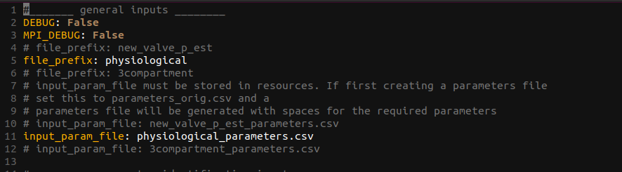
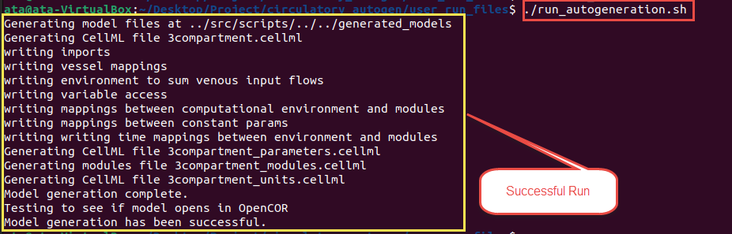
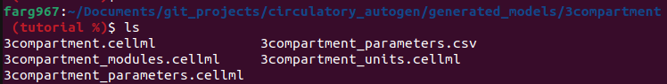
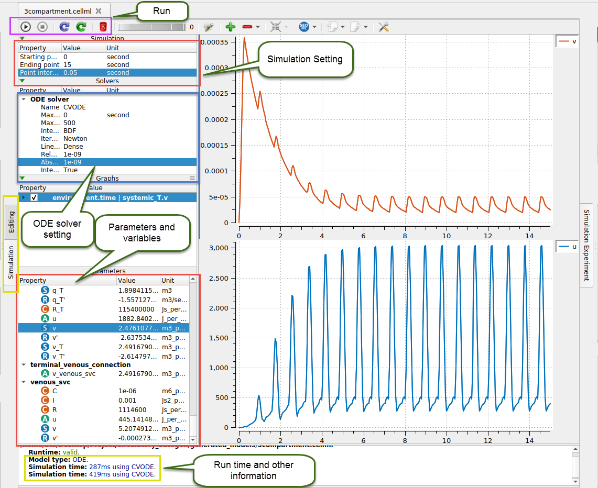

# Model Generation and Simulation

## Software Outline

The Circulatory_Autogen project (`[project_dir]`) contains five folders as presented below:       

- **resources**: Contains example config csv files that define models (`[file_prefix]_vessel_array.csv`), parameters (`[file_prefix]_parameters.csv`), parameters to calibrate (`[file_prefix]_params_for_id.csv`), and ground truth data to calibrate towards (`[file_prefix]_obs_data.json`) for generating and calibrating models.
- **src**: Containts the source code for autogeneration, parameter id, and other utilities.
- **user_run_files**: Includes bash run files for the user and the `user_inputs.yaml` file, which is the main config file for the run settings.
- **funcs_user**: Contains user defined functions for calculating ouput features from model outputs, for fitting to ground truths. The corresponding src file, which contains other available functions to use in the parameter id is `[project_dir]/src/param_id/operation_funcs.py`. This directory also contains functions for user defined cost functions.
- **module_config_user**: Contains user defined units, cellml modules, and configuration files for those cellml modules. This allows the user to create their own modules and specify how they can be coupled with other modules. The corresponding src dir, which contains all of the src modules and config files is `[project_dir]/src/generators/resources/`  

!!! Note 
    For recommended use, the user should create a separate [CA_user_dir] for the specific model they are creating. In dir there should be the following:

    - **[file_prefix]_user_inputs.yaml
    - **resources**: Contains the config csv files that defines model connection network ([file_prefix]_vessel_array.csv) and parameters ([file_prefix]_parameters.csv) that will be generated and config files to prescribe the parameters to calibrate ([file_prefix]_params_for_id.csv) and the ground truth to calibrate towards ([file_prefix]_obs_data.json).

!!! Note 
    set "external_modules_dir" to a directory where you store your cellml modules and config.json files if you want this to be external to the circulatory_autogen dir. 
    The cellml modules must end in modules.cellml

The following folders will be generated in `[CA_user_dir]` (or `[project_dir]` if `user_inputs_path_override` isn't defined) after running model autogeneration and parameter identification.

- **generated_models**: Includes the generated code for the models that have been automatically generated. It also contains the generated models with parameters that have been fit with the parameter identification code. These models can be run in OpenCOR or through OpenCOR's version of Python.
- **param_id_output**: Includes all of the outputs from the parameter identification simulations, including predicted parameter values, minimum costs, standard deviations of parameters (if doing MCMC) and plots of the fitting results and parameter distributions.

## Model Generation

This section shows how to generate your desired model. There are several examples to show the generality of the circulatory_autogen software.

The following are the steps for model autogeneration.

1. Create the **vessel_array** and **parameters** files in CSV format for the intended model. Standard names of vessel and parameters files are **[model name]_vessel_array.csv** and **[model name]_parameters.csv**, respectively. 

    Those files should be added to your `resources` directory which is set with `resources_dir` in your `[CA_user_dir]/[file_prefix]_user_inputs.yaml` (or `[project_dir]/user_run_files/user_inputs.yaml` if `user_inputs_path_override` isn't defined). 

!!! Note
    The standard location for the resources dir is `[CA_user_dir]/resources

!!! info
    If the name of your model is *3compartment*, the user files needed for generation are:

    - `3compartment_vessel_array.csv`
    - `3compartment_parameters.csv`

!!! Note
    You can refer to the section [Designing a new model](design-model.md) for more details on creating vessel_array and parameters files.

2. Go to the `[CA_user_dir]` and open the `[file_prefix]_user_inputs.yaml` to edit. You can use *gedit*, *nano*, *vim* or your editor of choice to edit the file. `file_prefix` should be the name of your model. Subsequently, `input_param_file` should be equal to `[file_prefix]_parameters.csv` as shown below.

    

3. To run the autogeneration, navigate to the `user_run_files` directory and run the below command.
        
        ./run_autogeneration.sh
        
    As shown below, this will create CellML files for the generated model and test that the simulation runs. Consequently, If there are no errors, it shows the *"Model generation has been successful."* message at the end.

!!! Note 
    Alternatively, you can use an IDE of your choice, set the python path equal to the `opencor_pythonshell_path` (see [getting started](getting-started.md) and 
    run script_generate_with_new_architecture.py from `[project_dir]/src/scripts`

    

4. Generated CellML files are located in the `[generated_models_dir]/[file_prefix]` directory. (The *generated_models_dir* defaults to `[project_dir]/generated_models` unless you set generated_models_dir in `[project_dir/user_run_files/user_inputs.yaml`). 

    Four CellML files, and a CSV file will be generated. The CSV file includes the model parameters and the four CellML files contain the modules, parameters, units and constants, and main model.

    

    !!! info
        For a typical autogeneration, the parameters.csv file will be the same as the parameters.csv file in `[project_dir]/resources` directory. However, when the parameter identification is run, it will contain the identified parameter values.

!!! Note
    There is a test for the autogeneration running. To run the test, navigate to `user_run_files` and run the below command.

        ./run_test_autogeneration.sh
    
## Model Simulation

Once you have generated the models, open OpenCOR and open the generated `[file_prefix].cellml`, which is the main CellML file. This file automatically incorporates the `[file_prefix]_modules.cellml`, `[file_prefix]_parameters.cellml` and `[file_prefix]_units.cellml` files.

When it is opened, click on the **Simulation** tab (highlighted with a yellow box in the below image). If there is no error, OpenCOR shows you a new page where models can be simulated. (If there is an error specific to the cellml code then it will be shown here.)

Several individual parts on this page are:

- Simulation settings
- ODE solver settings
- Parameters and variables
- Run control
- Run diagnostics
- Graphs and results

You should set the simulation's starting, ending, and data output step size. Also, if you have a stiff problem you may need to set the maximum_time_step to a small value.

ODE solver settings contains many settings related to the solver such as maximum step size, iteration method, absolute and relative tolerance, name of solver, etc. (shown in the blue box in the above image.)

The parameters and variables section shows all constant and variable parameters that are used in the model (See section [Creating a new model](create-model.md) for more information on setting up parameters). You can plot variables by right-clicking each parameter you want for the y-axis and then choosing the x-axis variable (eg: time). 

The run control is on the top left section, as shown in the purple color box in the image. Click on the triangle button to run. For further control, see the [OpenCOR Tutorial](https://tutorial-on-cellml-opencor-and-pmr.readthedocs.io/en/latest/_downloads/d271cfcef7e288704c61320e64d77e2d/OpenCOR-Tutorial-v17.pdf).

The results will be shown after running the model. These results include run-time, settings, and other related parameters, as shown in the yellow box at the bottom of the image.
