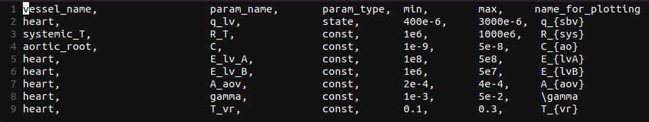
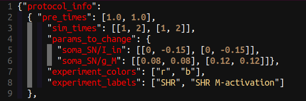
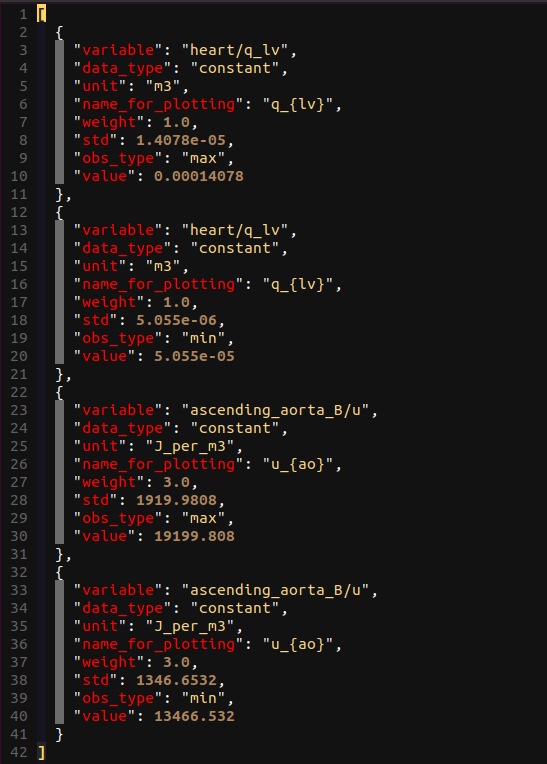
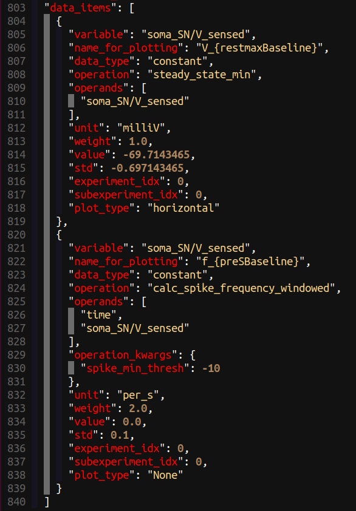
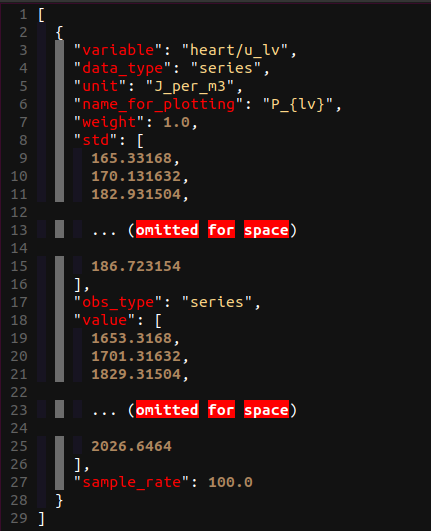
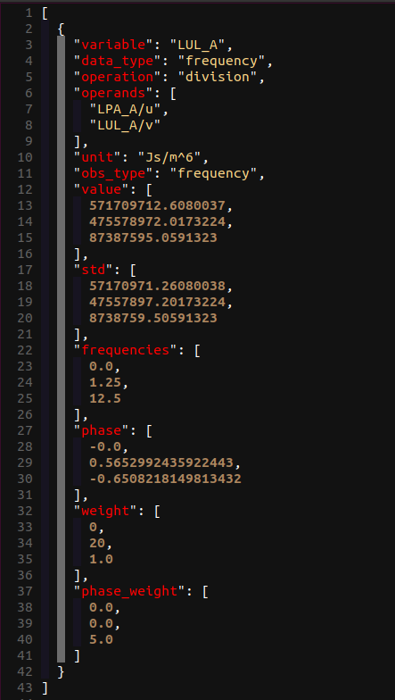
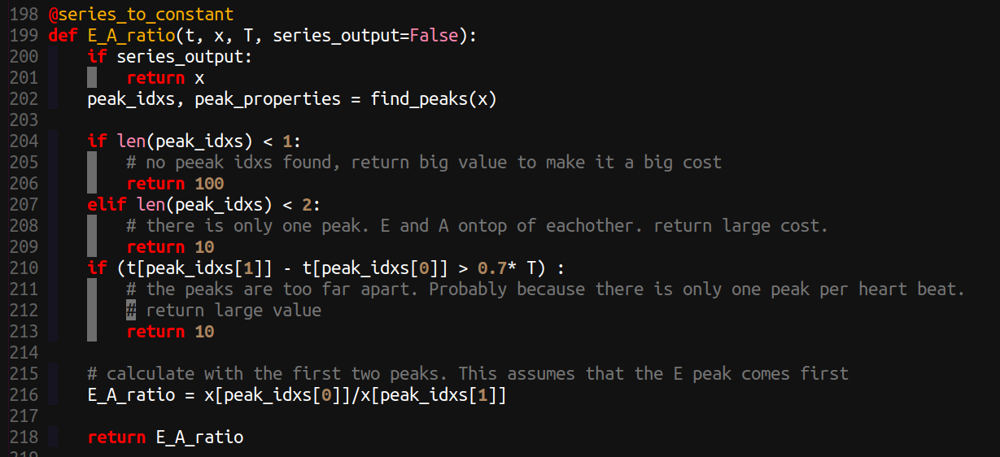
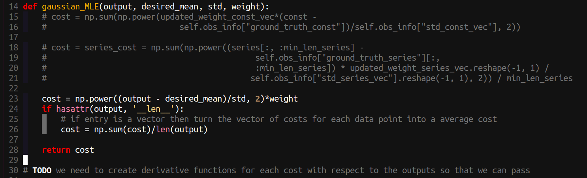

# Parameter Identification

The parameter identification part of Circulatory_Autogen is designed to allow calibration of a model to experimental or clinical data. It implements an optimisation method to find the best fit parameters that give a minimal (local minima) error difference between the model output and the ground truth observables (experimental or clinical data or user specified). The creation of below two configuration files is necessary: 

- **params_for_id**
- **param id observables**

Those files should be added to the `[CA_dir]/resources` directory (or your custom `resources_dir`). Proper names of the files are **[file_prefix]_params_for_id.csv** and **[file_prefix]_obs_data.json**, respectively. You can also set `params_for_id_file` in `user_inputs.yaml` if you want to use a non-standard filename.

## Prerequisites

- A generated model (see [Model Generation and Simulation](model-generation-simulation.md)).
- `param_id_obs_path` and `params_for_id` files in your resources directory.
- OpenCOR Python environment with MPI if running in parallel.


## Creating params_for_id file

This file defines which parameters (constants and initial_states) within your model that you will vary in the parameter id process and their allowed ranges (prior distribution). Following is an example of the `params_for_id.csv` file.



The entries in the file are detailed as follows:

- **vessel_name**: the name of the vessel/module the parameter is in
- **param_name**: the name of the parameter in the cellml module (not including the "vessel_name" suffix that is included in the `[file_prefix]_parameters.csv` file).
- **param_type**: **"state"** or **"const"**; whether the parameter is the initial value of a state or a const. 
- **min**: The minimimum of the range of possible values (min of the uniform distribution).
- **max**: The maximum of the range of possible values (max of the uniform distribution).
- **name_for_plotting**: The name (latex format) that will be used when automatically potting comparisons with observables and predictions.

!!! Note
    **param_type** will be deprecated. All should be **"const"**. Initial values that need to identified should be defined as constants within the cellml module.

!!! info
    In the future we plan on including other types of priors rather than just uniform.

## Creating param id observables file

This file defines the simulation protocol (protocol_info), and ground truth observables that will be used in the cost function for the parameter id optimisation algorithm. It also defines the measurement standard deviation, and weighting for each observable.

File path of the `obs_data.json` file should be defined as **param_id_obs_path** in `[CA_dir]/user_run_files/user_inputs.yaml`. This path can be absolute or relative to the location of your `user_inputs.yaml`.

!!! Note
    IMPORTANT: For creating obs_data.json files in python (strongly recommended over modifying the json by hand
    you can use the helper class in `src/utilities/obs_data_helpers.py`. See `src/scripts/example_format_obs_data_json_file.py` for an example 
    that you can copy and change for your parameter identification task.

### protocol info

The protocol info defines the numerical experiments you will be running. Here is an example for a sympathetic neuron calibration where the input current is changed
from 0 to 0.15 pA after 1 second then simulated for 2 seconds with that input current. This was performed in two experiments, the first experiment with a M-type potassium conductance of 0.08 uS and the second experiment with an increased M-type potassium channel conductance of 0.12 uS.



For the protocol we define each experiment as each new full simulation that needs to be run. Each subexperiment is a section of an experiment 
with its own set of parameters. Subexperiments generally relate to different time periods where the inputs in the experiments that are being used for 
calibration have a change in value (e.g. change in drug concentration, change in stimulatiion frequency, change in applied force). The entries in the protocol info are:

- **pre_times**: The amount of simulation that is done before you want to compare to observables or plot (this part of the simulation is thrown away. This
is mainly used to simulate for an amout of time to reach steady state or periodic state. shape = (number of experiments)
- **offline_pre_time** (optional): A single scalar, in seconds. Before any experiment runs, the solver performs one **unlogged** warmup integration for this duration, then stores the end state as the default state used when `reset_states()` is called at the start of each experiment. Use this to separate a long steady-state or periodic warmup from the logged **pre_times** phase. Supported for `CVODE_myokit`, `casadi_python`, and `python` (`solve_ivp`) backends; not available for OpenCOR. Example: `offline_pre_time: 19.0` with `pre_times: [1.0]` gives 20 s of total warmup before the first logged segment, equivalent to `pre_times: [20.0]` without `offline_pre_time`.
- **sim_times**: The length in time of each subexperiment. shape=(number of experiments, number of subexperiments) -- Note: the shape isn't completely correct here, the number of subexperiments can be different for each experiment
- **params_to_change**: A dictionary where the key is a parameter name and the entry is the assigned value of that parameter in each (experiment_idx, subexperiment_idx).
- **experiment_colors**: The line color for the plots of each experiment. 
- **experiment_labels**: The label for each experiment, which is used for plotting and naming plots.
- **protocol_traces** (optional): Named `{"t": [...], "values": [...]}` waveforms. A `params_to_change`
entry may be the *name* of one instead of a number, and the parameter then follows that waveform over the
subexperiment rather than being held constant.
- **protocol_shapes** (optional): The same thing written as events rather than as a table of points --
see below. A name is defined in `protocol_traces` **or** in `protocol_shapes`, whichever suits; both are
referred to from `params_to_change` the same way.

#### Time-varying inputs: protocol_shapes

A stimulus is easier to write as "1 unit, 2 ms long, every 1000 ms" than as the forty numbers that
describes. `protocol_shapes` takes the first form, using the same five fields as a Myokit `.mmt`
`[[protocol]]` table, so a protocol imported from Myokit needs no translation:

```
# .mmt                                  # obs_data.json
# Level  Start  Length  Period  Mult    "protocol_shapes": {
  1.0    100    2       1000    0           "stim": {"events": [{"level": 1.0, "start": 100,
                                                                "length": 2, "period": 1000,
                                                                "multiplier": 0}]}
                                        },
                                        "params_to_change": {"membrane/stim": [["stim"]]}
```

- **level** — the value the parameter takes during the event; outside every event it takes **baseline**
(default `0`).
- **start**, **length** — when the event begins and how long it lasts. `duration` is accepted as a synonym
for `length` (it is what Myokit's Python API calls it).
- **period** — how often it repeats; `0` means it happens once.
- **multiplier** — how many times it repeats; `0` means "for as long as the subexperiment runs", so the
number of beats follows `sim_times` rather than having to be counted out by hand.

A shape is expanded over the subexperiment that refers to it, so its length comes from `sim_times`. Give
the shape its own `duration` if you want to override that, which is also how a shape shared between
subexperiments of different lengths is disambiguated. Overlapping events are rejected, as they are in
Myokit, and so is a stimulus that never fires inside the time it is run over.

A step and a single pulse are just pacing events that do not repeat: a step is `{"level": v, "start": ts,
"length": <rest of the subexperiment>, "period": 0}` over a `baseline`, and a pulse is the same with a
shorter `length`. A linear sweep is not a square event, so it has its own type:

```json
"protocol_shapes": { "load": {"type": "ramp", "from": 0.0, "to": 5.0} }
```

which runs from `from` at the start of the subexperiment to `to` at its end.

The expansion happens when the file is read, so everything downstream -- the solvers, the plots -- sees an
ordinary `protocol_traces` entry and behaves exactly as it would have if you had written the points out.

### data items
Examples of `obs_data.json`, `data_item` entries are shown in below figures for constant, constant with operation_kwargs, series, and frequency data types, respectively. 






The entries in the data_item list in the `obs_data.json` file are:

- **variable**: This is the user defined observable name, it does not need to link to the cellml variable name.
- **data_type**: The format of the data. This can be *"constant"*, *"series"*, or *"frequency"* as shown above.
- **unit**: The unit of the observable.
- **name_for_plotting**: The name that will be in the automated plots comparing observable data to model output. (latex format)
- **weight**: The weighting to put on this observables entry in the cost function. Default should be 1.0
- **std**: The standard deviation which is used in the cost function. The cost function is the relative absolute error (AE) or mean squared error (MRE), each normalised by the std.
- **value**: The value of the ground truth, either a scalar for constant data_type, or a list of values for series or frequency data_types.
- **obs_dt**: required for *series* data types and not needed for constant or frequency. It defines the timestep for the observable series values.
- **prob_dist_params**: the ground truth when it is a *distribution* rather than a value — see below. An item that sets this needs no **value** or **std**; an item that does not, needs both.

### Ground truth as a distribution (`prob_dist_params`)

Some observables are not known as a single number plus a standard deviation. A measurement repeated across a cohort is a **set of points**, and it may not even be unimodal. For these, state the ground truth as `prob_dist_params` and choose a `cost_type` that scores against a distribution:

| cost_type | `prob_dist_params` | scores the output against |
|---|---|---|
| `kernel_density_estimation` | `{"data_points": [...]}` | a smooth density fitted to the measured points, with no assumption about how many modes there are |
| `multimodal_gaussian` | `{"means": [...], "stds": [...], "scales": [...]}` | a named mixture of gaussians (`scales` must sum to 1) |
| `poisson_MLE` | `{"k": <count>}` | a Poisson likelihood, where the model output is the rate |

The observable itself is still an ordinary **constant**: the model produces one scalar, exactly as for `gaussian_MLE`. Only what it is compared against differs, and that follows from `cost_type`.

```json
{
  "variable": "x_steady_state",
  "data_type": "constant",
  "operation": "steady_state_avg",
  "operands": ["benchmark/x"],
  "unit": "dimensionless",
  "weight": 1.0,
  "cost_type": "kernel_density_estimation",
  "prob_dist_params": {"data_points": [1.05, 0.99, 4.08, 3.96, "..."]},
  "cost_kwargs": {"bandwidth": 0.1}
}
```

Anything that *tunes* the comparison rather than stating the data goes in `cost_kwargs` — for `kernel_density_estimation` that is `bandwidth`, the KDE smoothing width (a number, `"scott"` or `"silverman"`; Scott's rule by default), which you can change without touching the measurements.

### Series ground truth from `.npy` files (`t_path` and `value_path`)

For large time-series observables you can store arrays in NumPy files instead of embedding long lists in the JSON. On load, Circulatory Autogen reads the files and fills in any missing `value` and `obs_dt` fields before calibration runs. You must still set `std` in the JSON (see below).

- **t_path**: Path to a `.npy` file containing the time vector (seconds).
- **value_path**: Path to a `.npy` file containing the observable values. This is always the quantity that will be compared to the model .

Paths may be absolute or relative to the process working directory when parameter identification is started. If `value` is already present in the JSON, the file path should not be set;

Example `data_item` entry:

```json
{
  "variable": "P aortic root",
  "data_type": "series",
  "operands": ["aortic_root/u"],
  "operation": null,
  "unit": "Pa",
  "weight": 1.0,
  "std": 500.0,
  "t_path": "/path/to/pressure_time.npy",
  "value_path": "/path/to/pressure_values.npy",
  "experiment_idx": 0,
  "subexperiment_idx": 0
}
```

If `obs_dt` is omitted, it is estimated from the mean step in `t_path`. For `std`, provide either one positive number (applied to every sample in the series) or a list with one entry per sample (same length as `value` after load).

!!! warning
    The `dt` or `sample_rate` fields are deprecated for series data. Use `obs_dt` instead.
Not to be confused with the dt for the model simulation outputs.
- **operation**: This defines the operation that will be done on the operands/variable. The possible operations to be done on model outputs are defined in `[CA_dir]/src/param_id/operation_funcs.py` and in `[CA_dir]/funcs_user/operation_funcs_user.py` for user defined operations.
- **operation_kwargs**: An optional dictionary of keyword arguments (kwargs) and their values, passed to the chosen python operation function on top of the operands. Defaults to `{}`. See [operation_kwargs](#operation_kwargs) below for the full contract.
- **operands**: The above defined "operation" can take in multiple variables. If operands is defined, then the "variable" entry will be a placeholder name for the calculated variable and the operands will define the model variables that are used to calculate the final feature that will be compared to the observable value entry/s.
- **experiment_idx** and **subexperiment_idx**: Optional indices to link a data item to a specific experiment/subexperiment in `protocol_info`.

!!! warning
    **obs_type**: Deprecated in favor of **operation**.

### operation_kwargs

`operation_kwargs` is an optional, per-`data_item` dictionary of keyword arguments for that item's
`operation` func. It is a supported public field of `obs_data.json` (it is what the
[CUFLynx](https://github.com/physiomelinks/CUFLynx) editor writes when you tune an operation's
options in the GUI), and it behaves identically in calibration, MCMC/UQ and sensitivity analysis.

At run time Circulatory Autogen calls:

```python
operation(*operands, **operation_kwargs)
```

so the `operands` fill the operation func's leading positional arguments and `operation_kwargs`
fills its keyword arguments. For example, with the user operation

```python
@series_to_constant
def mean_in_range(x, start_frac=0.0, end_frac=1.0, series_output=False):
    ...
```

a `data_item` can ask for the mean over the last 20% of the sub-experiment:

```json
{
  "variable": "P aortic root",
  "name_for_plotting": "u_{ARlate}",
  "data_type": "constant",
  "operation": "mean_in_range",
  "operands": ["aortic_root/u"],
  "operation_kwargs": { "start_frac": 0.8, "end_frac": 1.0 },
  "unit": "J_per_m3",
  "weight": 1.0,
  "value": 12000,
  "std": 1200
}
```

The rules are:

- **Optional, default `{}`.** Omitting `operation_kwargs` (or leaving it empty/null) calls the
  operation func with its own defaults, exactly as before.
- **Keys must be keyword arguments of the operation func.** An unknown or misspelled key is an
  **error**, not silently ignored -- otherwise a stale obs_data file would quietly calibrate against
  a different feature than you asked for. The error names the data item, the operation func, the
  offending key and the accepted keys, and it is raised as soon as the observation data is set,
  before any simulation runs. A func that declares `**kwargs` (like
  `calculate_two_observable_difference`) accepts any key.
- **Keys already filled from `operands` are rejected.** If `operands` supplies the operation's
  first argument `x`, you cannot also pass `"x"` in `operation_kwargs`.
- **`series_output` is reserved.** Circulatory Autogen sets it itself when it needs the trace for
  plotting, so a `data_item` must not set it.
- **String values can reference an earlier observable.** A string value that matches the
  `name_for_plotting` of an earlier `data_item` is replaced, at run time, by that observable's
  computed value. This is how an observable is built from other observables -- see
  `calculate_two_observable_difference` in `funcs_user/operation_funcs_user.py` and
  `resources/3compartment_extra_ops_obs_data.json`. A string that matches no earlier observable is
  passed through unchanged, so plain string options still work. Note that the referenced item must
  appear **earlier** in `data_items` than the item that references it.
- **Type coercion is minimal.** JSON has a single number type, so a value written as `20.0` where
  the func's default is the integer `20` is converted to `int`, and an integer written where the
  default is a float is converted to `float`. Nothing else is coerced: strings, booleans, lists and
  `null` reach the operation func as-is.

User-defined operation funcs receive `operation_kwargs` exactly like the built-ins. This includes
funcs in `funcs_user/operation_funcs_user.py`, funcs in a file pointed to by
`operation_funcs_external_path` in `user_inputs.yaml`, and funcs registered from python with
`add_user_operation_func()`.

When building obs data in python rather than as a file, pass the same field through
`ObsDataCreator.add_data_item({... , "operation_kwargs": {...}})`.

### Building an observable from other observables

Sometimes the quantity you want to fit is not something the model reports directly, but a
combination of quantities it does. If you have a ground truth for the mean flow and another for
the peak flow, what you actually know may be the difference between them -- the pulse amplitude --
and that difference is what you want the cost to see.

An observable can therefore be computed from observables defined earlier in `data_items`, using
the string-reference rule described above: a string in `operation_kwargs` that matches an earlier
item's `name_for_plotting` is replaced by that item's computed value.

`funcs_user/operation_funcs_user.py` ships `calculate_two_observable_difference` for the two-term
case. It takes its inputs as `pred1` and `pred2` and returns `pred2 - pred1`:

```json
{
  "variable": "flow aortic root",
  "name_for_plotting": "v_{ARmean}",
  "data_type": "constant",
  "operation": "mean",
  "operands": ["aortic_root/v"],
  "unit": "m3_per_s", "weight": 1.0, "value": 0.0001, "std": 1e-05
},
{
  "variable": "flow aortic root",
  "name_for_plotting": "v_{ARmax}",
  "data_type": "constant",
  "operation": "max",
  "operands": ["aortic_root/v"],
  "unit": "m3_per_s", "weight": 1.0, "value": 0.0005, "std": 5e-05
},
{
  "variable": "flow aortic root",
  "name_for_plotting": "v_{ARdelta}",
  "data_type": "constant",
  "operation": "calculate_two_observable_difference",
  "operands": [""],
  "operation_kwargs": { "pred1": "v_{ARmean}", "pred2": "v_{ARmax}" },
  "unit": "m3_per_s", "weight": 1.0, "value": 0.0004, "std": 5e-05
}
```

`resources/3compartment_extra_ops_obs_data.json` is this example as a complete, working file.

Three things to get right:

- **Order matters.** An observable can only reference items that appear *before* it in
  `data_items`, because the values are computed in file order and the reference is resolved
  against the ones already computed.
- **`operands` is empty**, written `[""]`. The item takes its inputs from `operation_kwargs`
  rather than from a model variable, so there is no trace to reduce. `variable` is still filled in
  for labelling.
- **`name_for_plotting` must be unique.** It is the key the reference is resolved against, so two
  items sharing a name means the later one silently replaces the earlier, and a reference gets a
  value from the wrong item. Nothing errors -- the run simply fits the wrong feature. Likewise a
  name that matches nothing is passed through to the operation func as a plain string rather than
  raising, so a typo shows up as a strange result rather than a failure.

To combine more than two observables, or to combine them some other way, write your own operation
func in `funcs_user/operation_funcs_user.py` (see
[Creating your own operations](#creating-your-own-operations)) and name it in `operation`. It
receives the referenced values as keyword arguments, so it needs to accept them -- either by
declaring them explicitly or with `**kwargs`. `@series_to_constant` marks it as returning a
single number rather than a trace:

```python
@series_to_constant
def combine_three_observables(x=None, series_output=False, **kwargs):
    return kwargs["pred3"] - kwargs["pred2"] - kwargs["pred1"]
```

and the `data_item` names it in `operation` with one `operation_kwargs` entry per input:

```json
"operation": "combine_three_observables",
"operands": [""],
"operation_kwargs": { "pred1": "v_{ARmean}", "pred2": "v_{ARmax}", "pred3": "v_{ARmin}" }
```

!!! note
    Older versions could fail with `TypeError: operation_funcs.mean() argument after ** must be a
    mapping, not float` when a `data_item` had no `operation_kwargs`. This is fixed: every place
    that forwards `operation_kwargs` now goes through
    `param_id.operation_funcs.resolve_operation_kwargs`, which treats a missing/null/NaN value as
    "no kwargs" and raises a descriptive `ValueError` (naming the data item, the operation and the
    accepted keys) for a key the operation func does not accept.

### prediction items (optional)

You can include a `prediction_items` list in `obs_data.json` to request additional model outputs to plot (not used in the cost function). Each entry includes:

- **variable**
- **unit**
- **experiment_idx** (optional; defaults to 0)
- **name_for_plotting** (optional)

## Running external cellml models

Running cellml models that weren't generated with Circulatory_Autogen is also just as straightforward:

Simply set the `file_prefix` in your user_inputs.yaml file to the name of your cellml model `<file_prefix>.cellml`. Then set `generated_models_dir` to the path to the dir where your model subdir is and the subdir where the calibrated model will be generated. Make sure your cellml file/files are in a directory of the same name i.e.:

`path/to/your/generated_models_dir/<file_prefix>/<file_prefix>.cellml`

After calibration, the following directory will be created with your generated model:

`path/to/your/generated_models_dir/<file_prefix>_<obs_file_name>/`

!!! note
    Currently the generated model needs to be run in newer OpenCOR with the LibOpenCOR backend because a CellML 2.0 model is generated.

## Creating your own operations

To enable flexibility we allow you to create your own user-defined operation functions in python to extract features from your model outputs and compare to data in the calibration.
Available operation functions can be found in `src/param_id/operation_funcs.py` and in the file made for adding your own operation functions in `funcs_user/operation_funcs_user.py`.
Here is an example of an operation function for calculating the ratio of the two peaks (used for mitral valve flow).



Note:

- kwargs can be used and defined for each entry in your obs_data.json with `operation_kwargs`, see above.
- `if series_output` is needed to return the variable trace for plotting.
- A more elegant method of returning a high cost if the observable can't be calculated is being discussed.
    

## Creating your own cost functions

To allow even more flexibility, we also allow users to define their own cost functions (or likelihood functions). These can be found at `funcs_user/cost_funcs_user.py`.
An example for the maximum likelihood estimator for gaussian noise (equivalent to weighted mean squared error) is:



Note:

- Currently there are no kwargs for user defined cost functions. But there will be: see [issue](https://github.com/FinbarArgus/circulatory_autogen/issues/84)

## Solver

Before doing calibration, a solver for the model needs to be chosen

- **solver** defines the solver family. Options depend on `model_type`:
    - CellML (`model_type: cellml_only`): `CVODE` defaults to `CVODE_myokit` (Myokit). Use `CVODE_opencor` explicitly if you want the OpenCOR backend instead.
    - Python (`model_type: python`): `solve_ivp` with `solver_info.method` set to `RK45`, `BDF`, etc.
    - CasADi Python (`model_type: casadi_python`): `casadi_integrator` with `solver_info.method` set to `cvodes`, `idas`, `collocation`, `rk`, `semi_implicit_euler`, or `bdf`.
    - C++ (`model_type: cpp`): `CVODE`, `RK4`, or `PETSC`.
- **solver_info** defines settings for the chosen solver:
    - **dt_solver**: solver time step (for CVODE this sets `MaximumStep` when provided)
    - **MaximumStep**: maximum step size for adaptive solvers
    - **MaximumNumberOfSteps**: maximum number of substeps before stepping
    - **method**: any method for `solve_ivp` or `casadi_integrator`, e.g. `RK45`, `BDF`, `cvodes`, etc.

!!! note "Automatic differentiation supports `constant` and `series` observables only"
    With `do_ad: true` the cost is built symbolically. `constant` and `series` data items are
    both supported, and `dt` does not have to equal a series item's `obs_dt`: the simulated
    series is linearly interpolated onto the observation times, which is a multiply by a matrix
    of weights fixed by the two time grids, so it stays differentiable. Frequency (`amp` /
    `phase`) observables cannot be differentiated yet, and raise rather than silently
    contributing nothing to the cost.

!!! note "CasADi `semi_implicit_euler` — enables automatic differentiation on stiff models (verify with a convergence study)"
    When using gradient-based parameter identification (`param_id_method: sp_minimize` with
    `do_ad: true`) on a **very stiff** model, the adaptive `cvodes` integrator can solve the
    forward problem but its **adjoint-sensitivity gradient fails** (e.g. CasADi raises
    `CVodeF returned "CV_ERR_FAILURE"`). The full 3compartment cardiovascular model — whose
    valve dynamics are extremely stiff and contain discontinuous (`floor`-driven) heart
    activation — is a typical case.

    For these models set `solver_info.method: semi_implicit_euler`. This is a fixed-step,
    **linearly-implicit (semi-implicit) Euler** scheme with diagonal-Jacobian damping:

    ```
    x_{n+1} = x_n + dt * f(x_n) / (1 - dt * d f_i / d x_i)
    ```

    The damping term stabilises the stiff modes at the model `dt`, and because the whole
    integrator is built as a single symbolic graph, CasADi differentiates the cost by ordinary
    reverse-mode AD — there is **no adjoint ODE solver to fail**. This makes exact gradients
    (and gradient-based optimisation) available for stiff models where `cvodes` cannot produce
    a gradient.

    ```yaml
    model_type: casadi_python
    solver_info:
      solver: casadi_integrator
      method: semi_implicit_euler
      max_step_size: 0.001
    ```

    !!! warning "Less accurate than `cvodes` — do a convergence study"
        `semi_implicit_euler` is a **first-order, fixed-step** scheme that damps using only
        the **diagonal** of the Jacobian, so it is **less accurate than the adaptive `cvodes`
        integrator** and, on a stiff model, can noticeably differ from the true (CVODE)
        trajectory at a practical `dt`. It is provided so that AD gradients are *available*
        on stiff models where `cvodes` cannot produce one — not because it is the accurate
        choice.

        **Do not trust the results at a single `dt`.** Perform a convergence study: rerun
        with progressively smaller `dt` (e.g. halve it) and confirm the trajectories and the
        identified parameters stop changing meaningfully before relying on them. Where
        `cvodes` works, it remains the more accurate default.

!!! tip "CasADi `bdf` — a more accurate stiff AD method that also supports a long `pre_time`"
    `bdf` is a fixed-step, symbolic implicit **BDF2** scheme (a rootfinder per step, differentiated
    through the implicit-function theorem). Like `semi_implicit_euler` it is built as a single
    symbolic graph, so CasADi produces exact gradients by reverse-mode AD with no adjoint solver to
    fail — but it is **second order and full-Jacobian implicit**, so it tracks a stiff trajectory
    far more accurately than the first-order, diagonally-damped `semi_implicit_euler` at the same
    `dt`. It also handles a nonzero `pre_time` warmup (unlike `cvodes`, whose adjoint typically
    fails with `CV_TOO_MUCH_WORK` over a long warmup). Prefer `bdf` over `semi_implicit_euler` for
    stiff models; still do a convergence study in `dt`.

    ```yaml
    model_type: casadi_python
    solver: casadi_integrator
    do_ad: true
    solver_info:
      method: bdf
      max_step_size: 0.001
    ```

!!! tip "Myokit CVODES forward sensitivity — AD gradients for `cellml_only` models"
    A `cellml_only` model run through the Myokit backend can produce an exact gradient without
    converting to `casadi_python`, using Myokit's native **CVODES forward-sensitivity analysis
    (FSA)**. Set `model_type: cellml_only`, `solver: CVODE_myokit`, `do_ad: true`, and a
    gradient-based `param_id_method` (`sp_minimize` or `multi_start_sp_minimize`). FSA integrates
    the state and sensitivity equations together with the adaptive stiff CVODES solver, so it
    handles **stiff dynamics and a long `pre_time` warmup natively** while staying as accurate as
    the forward simulation itself.

    ```yaml
    model_type: cellml_only
    solver: CVODE_myokit
    do_ad: true
    param_id_method: multi_start_sp_minimize
    solver_info:
      rtol: 1e-9
      atol: 1e-9        # tight tolerances keep the sensitivities out of the integrator noise floor
    ```

    A parameter that only sets a **state's initial value** cannot be a CVODES sensitivity
    independent; such parameters automatically fall back to finite differences (a one-line warning
    reports how many and which). Tighten `rtol`/`atol` when using FSA so the sensitivities are well
    resolved.

!!! warning "our AADC wrapper is not yet suitable for stiff models or multiple observables"
    The AADC tape backend (`model_type: aadc_python`) records a **fixed-step** integrator, which is
    inaccurate or unstable on stiff models — on the 3compartment cardiovascular model its
    fixed-step implicit solve deviates from CVODE by orders of magnitude. Every AADC run now probes
    the first second of dynamics and prints a loud warning if the model is stiff, pointing you at
    CasADi `bdf` or Myokit CVODES FSA instead.

    **AADC is also not currently suitable for problems with multiple observables.** Its tape cost
    can only represent an observable whose operand is a **state** with a reimplemented operation
    (`max`/`min`/`mean`), in a **single** experiment. Any other observable — one whose operand is an
    **algebraic variable** (e.g. a pressure or flow computed from the states rather than integrated),
    an operation the tape does not reimplement (e.g. `max_minus_min`), or a `series`/other data type
    — **cannot be put on the tape**. Rather than silently minimise a reduced cost over only the
    tapeable subset (which would give a fit that is wrong for the omitted observables), the AADC
    gradient path **raises an error** as soon as any observable in the set can't be taped, naming
    the offending observables and pointing at the tracking issue (#258). On the 3compartment model,
    for instance, only 2 of the 6 observables are tapeable (the `aortic_root/u` features are
    algebraic and `heart/q_lv` uses `max_minus_min`), so AADC refuses to run there and is left off
    that benchmark. Full-cost parity needs the algebraic variables recomputed on the tape from the
    state trajectory and `max_minus_min` support (tracked in issue #258). Until then, use AADC only
    for non-stiff, single-experiment problems whose observables are all state-operand
    `max`/`min`/`mean` features (or state series); for other observables use `casadi_python`
    (`method: bdf`) or a Myokit CVODES FSA run, which the error message also points you to. Future
    work will get it working for stiff models and general observables so its advantages for large
    numbers of parameters can be used.

    **Multiple sub-experiments / experiments are not yet supported by the AADC wrapper.** The tape
    records one straight-line integration, so a protocol with more than one sub-experiment (or more
    than one experiment) raises rather than silently differentiating the wrong thing. The Myokit
    CVODES FSA gradient (`model_type: cellml_only` + `solver: CVODE_myokit`) does support multi-sub
    protocols; the AADC equivalent is tracked as future work.


## Parameter Identification Settings

To run the parameter identification we need to set a few entries in the `[CA_dir]/user_run_files/user_inputs.yaml file`:

- **param_id_method**: this defines the optimisation method we use. Currently supported methods are:
    - **genetic_algorithm**: Genetic algorithm optimizer (default, well-tested)
    - **CMA-ES**: Covariance Matrix Adaptation Evolution Strategy using Nevergrad (supports parallel execution)
    - **bayesian**: Bayesian optimization using scikit-optimize (deprecated, untested)
    - **sp_minimize**: Gradient-based optimizer (L-BFGS-B, local only)
    - **multi_start_sp_minimize**: Multi-start L-BFGS-B — a gradient-based descent from many scattered starting points, so it exploits the gradient but still escapes local minima
- **pre_time**: this is the amount of time the simulation is run to get to steady state before comparing to the observables from `obs_data.json`. IMPORTANT: THis is overwritten by the pre_times within the obs_data.json file, see the next section.
- **sim_time**: The amount of time used to compare simulation output and observable data. This should be equal to the length of a series observable entry divided by the "sample_rate". If not, only up to the minimum length of observable data and modelled data will be compared. 
- **dt**: The output (sample) time step for model outputs
- **solver_info.dt_solver**: The solver time step for CVODE (sets MaximumStep when provided)
- **solver_info.MaximumStep**: The CVODE maximum step size if dt_solver is not provided
- **param_id_obs_path**: the path to the `obs_data.json` file described above (absolute or relative to your `user_inputs.yaml`).
- **ga_options**: Legacy dictionary (deprecated, use `optimiser_options` instead):
	- **cost_type**: "AE" or "MSE" for absolute error or mean squared error.
	- **num_calls_to_function**: How many forward simulations of pre_time+sim_time will be run in the optimisation algorithm.
	- **cost_convergence**: If the cost value is lower than this threshold then the calibration run is complete.
	- **max_patience**: If the cost doesn't improve for this number of simulations, then calibration is complete (we assume that the cost has converged to the global minima or can't get out of a local minima).
  - Note: For backwards compatibility, entries in `ga_options` are automatically merged into `optimiser_options` if not already present. It is recommended to use `optimiser_options` instead.

- **optimiser_options**: Dictionary for optimizer-specific options (preferred over `ga_options`). Common options shared across optimisers:
    - **num_calls_to_function**: Maximum number of function evaluations (default: 10000)
    - **cost_convergence**: Convergence tolerance for cost (default: 0.0001)
    - **max_patience**: Maximum patience for convergence (default: 10)
    - **cost_type**: Cost function type (e.g., 'MSE')
  
    CMA-ES specific options:

    - **sigma0**: Initial standard deviation for CMA-ES (optional, default: 0.2 of parameter range)
    - Note: 
        - The number of parallel workers is automatically determined from the number of MPI processes
        - Initial parameter values are automatically loaded from `{file_prefix}_parameters.csv`
    
    sp_minimize specific options:

    - **do_ad**: Boolean value to determine whether to use automatic differentiation for gradient calculation. If it's set to *False*, gradients will be estimated using finite difference approximation.

    multi_start_sp_minimize specific options:

    - **num_starts**: Number of L-BFGS-B descents to run (default: 10, or 4 when `DEBUG` is true). The starts are spread round-robin over the MPI ranks; make `num_starts` several times the rank count so the work balances (see the note under "Multi-start Gradient-based Optimizer" below).
    - **start_sampling**: How the starting points are scattered over the parameter bounds: `sobol` (default), `latin_hypercube` or `random`.
    - **include_init_point**: If true (default), the first start is the initial parameter values from `{file_prefix}_parameters.csv`, so this method can never do worse than a single-start `sp_minimize` run.
    - **seed**: Seed for the start sampler (default: 0), so a run is repeatable.
    - **fd_step**: Finite-difference step used when an automatic-differentiation gradient isn't available — i.e. any configuration without an AD backend (see the gradient-backend note below), or when `do_ad: false` (default: 1e-4).
    - **cost_convergence**: Once any start reaches this cost, every MPI rank stops launching new starts (signalled between ranks with a non-blocking message), so no rank keeps working after a good-enough solution has been found. (Set `no_new_starts_on_convergence: false` to disable this.)
    - **no_new_starts_on_convergence**: `true` (default) is the behaviour above — stop launching starts once one converges. Set to `false` to run **every** start regardless, then report how many converged and how many landed in each distinct minimum. That maps the basin structure of a multi-modal problem (which minima exist, and how the starts split between them); the counts are written to `multi_start_convergence_clusters.csv` and printed at the end of the run.
    - **convergence_cluster_tol_frac**: When counting how many starts reached each minimum, two converged starts are treated as the same solution if every parameter agrees to within this fraction of that parameter's range (default: 0.02, i.e. 2%).

    !!! note "Automatic-differentiation gradient backends"
        Gradient-based calibration (`do_ad: true`) is provided by two open-source backends:
        **CasADi** (`model_type: casadi_python`, LGPL — symbolic differentiation) and **Myokit
        CVODES forward sensitivity** (`model_type: cellml_only` + `solver: CVODE_myokit`). Both
        require no proprietary licence and both handle stiff models; see the Solver section for
        which method to pick.

        Circulatory Autogen also ships an *optional* adapter for **AADC (Matlogica)**, which
        is **third-party proprietary software, not part of Circulatory Autogen**, not
        bundled with it, and restricted to academic/non-commercial use under Matlogica's own
        licence. It is not required. It can drive `sp_minimize` / `multi_start_sp_minimize`
        only for **non-stiff, state-observable, single-experiment** problems (its tape records
        a fixed-step integrator); it is unsuitable for stiff models such as the full
        cardiovascular model. See [Optional third-party backends](getting-started.md) if you
        already hold a Matlogica licence.

- **ga_options**: Legacy dictionary for optimization options. For backwards compatibility, entries in `ga_options` are automatically merged into `optimiser_options` if not already present. It is recommended to use `optimiser_options` instead.


## Choosing an Optimization Method

### Genetic Algorithm (genetic_algorithm)
- **Pros**: Well-tested, robust, handles non-smooth cost functions well
- **Cons**: Can be slower, requires more function evaluations
- **Best for**: Complex, multi-modal optimization problems, when you have many function evaluations available

### CMA-ES (CMA-ES)
- **Pros**: Efficient gradient-free optimization, supports parallel execution, good convergence properties
- **Cons**: Requires Nevergrad package (`pip install nevergrad`)
- **Best for**: Smooth optimization landscapes, when you want faster convergence with parallel execution

Example configuration for CMA-ES:
```yaml
param_id_method: CMA-ES
optimiser_options:
  num_calls_to_function: 10000  # shared option
  cost_convergence: 0.001         # shared option
  sigma0: 0.1                      # CMA-ES specific (optional, initial standard deviation)
  # Note: Initial parameter values are automatically loaded from {file_prefix}_parameters.csv
```

### Gradient-based Optimizer (sp_minimize)
- **Pros**: Efficient gradient-based optimization, fast convergence
- **Cons**: Can get stuck in local minima
- **Best for**: Smooth optimization landscapes, when you want faster convergence

For an AD gradient use `model_type: casadi_python` (CasADi symbolic differentiation) or a
`cellml_only` model run through `solver: CVODE_myokit` with `do_ad: true` (Myokit CVODES forward
sensitivity — see the Solver section). Any other configuration falls back to a finite-difference
gradient.

### Multi-start Gradient-based Optimizer (multi_start_sp_minimize)

L-BFGS-B only ever finds the minimum of the basin it starts in, so on a multi-modal cost surface `sp_minimize` is at the mercy of the initial parameter values. This method scatters `num_starts` starting points over the parameter bounds and runs a bounded L-BFGS-B descent from each one, keeping the best minimum found. It explores globally, like the population-based optimisers, while still using the gradient to descend each basin quickly and accurately.

- **Pros**: Escapes local minima while still exploiting the gradient; the starts are independent so they are distributed over the MPI ranks with no communication; typically reaches a far lower cost than a gradient-free global search for the same wall-clock time.
- **Cons**: Cost scales with `num_starts`; a very rugged surface may need many starts.
- **Best for**: Multi-modal cost surfaces — the common case when calibrating oscillatory models, where a wrong rate constant puts the simulation out of phase with the data.

!!! note "Parallel multi-start pays off only for many starts"
    The starts are distributed statically round-robin over the MPI ranks (`run_param_id.sh` with `num_processors > 1`). Because individual L-BFGS-B descents vary a lot in length — some converge in a handful of iterations, some take many — the per-rank workloads only even out when **each rank runs many starts**, i.e. when `num_starts` is much larger than the number of ranks. With `num_starts ≤ num_processors` each rank runs a single descent and the wall-clock is bounded by the slowest one, so extra ranks buy little. As a rule of thumb, run with several times as many starts as ranks. Measured on a 20-core host with 100 starts: ~3.8× on 4 ranks, ~4× on 8. Once any start reaches `cost_convergence`, every rank stops launching new starts, so a converged run doesn't keep the other ranks busy needlessly. `run()` reports the achieved speedup in its final log line.

This works for **any** `model_type`. The gradient comes from `get_gradient()`, which has an AD backend for `casadi_python` (symbolic jacobian), `cellml_only` run through `CVODE_myokit` with `do_ad: true` (Myokit CVODES forward sensitivity), and `aadc_python` (tape reverse pass — non-stiff, state-observable, single-experiment problems only; see the AADC caveat in the Solver section). For every other configuration there is no AD gradient, so the cost is evaluated with the usual simulation cost and the gradient falls back to finite differences.

Example configuration:
```yaml
param_id_method: multi_start_sp_minimize
model_type: casadi_python     # for AD gradients; other model types use finite differences
solver: casadi_integrator
do_ad: true
optimiser_options:
  cost_convergence: 0.0001
  num_starts: 10              # number of L-BFGS-B descents
  start_sampling: sobol       # sobol | latin_hypercube | random
  include_init_point: true    # first start is the x0 from {file_prefix}_parameters.csv
  seed: 0
```

Alongside the usual `best_cost_history.csv` / `best_param_vals_history.csv` (written as a running-best curve over the concatenated starts), this optimiser writes a **`multi_start_summary.csv`** with one row per start — its initial cost, final cost, iteration count and final parameter values. That tells you how many distinct basins your starts fell into, which is the quickest way to see whether `num_starts` is high enough.

It also streams three live per-start histories *during* the run, appended one row per L-BFGS-B iteration (iteration `0` is the start point), independent of `DEBUG`: **`multi_start_cost_history.csv`** (`start_idx, iteration, cost`), **`multi_start_param_vals_history.csv`** (`start_idx, iteration,` then one named column per parameter, holding the *actual* parameter values — same columns as `multi_start_summary.csv`) and **`multi_start_gradient_history.csv`** (`start_idx, iteration,` then one named column per parameter, holding the cost gradient `dJ/dp` in real parameter space at that iterate). Group by `start_idx` and order by `iteration` to plot a cost-, parameter- and gradient-vs-iteration line per start while the run is still going. The three files share the same `(start_idx, iteration)` keys, and `start_idx` is a stable global index, so rows from starts running concurrently on different MPI ranks demux cleanly regardless of interleaving.

#### Benchmark: FitzHugh-Nagumo

`resources/FitzHugh_Nagumo_*` is a deliberately multi-modal benchmark. The FitzHugh-Nagumo excitable-cell model

$$\dot V = c\left(V - \tfrac{V^3}{3} + R\right), \qquad \dot R = -\tfrac{1}{c}\left(V - a + bR\right)$$

is a standard hard case for parameter estimation: its least-squares surface has many local minima, because a wrong recovery rate `c` puts the simulated spike train out of phase with the data (Ramsay et al. 2007, *J. R. Statist. Soc. B* 69(5), "Parameter estimation for differential equations: a generalized smoothing approach"). The supplied `FitzHugh_Nagumo_parameters.csv` starts at `(a, b, c) = (0.8, 0.9, 2.0)`, which sits inside a local basin; the true values are `(0.2, 0.2, 3.0)`.

`sp_minimize` never leaves the basin it starts in. The genetic algorithm escapes it but, being gradient-free, converges slowly. The multi-start finds the global basin *and* refines it with the gradient — whatever gradient backend drives it (finite differences, CasADi AD, or Myokit CVODES FSA). The table below is regenerated by the benchmark runner (`python benchmarks/run_benchmarks.py --update-docs`) and by the **Benchmarks** GitHub Actions workflow, so the published numbers stay current; they depend on the hardware and MPI rank count used.

<!-- BENCHMARK_RESULTS_START -->
*Generated by `benchmarks/run_benchmarks.py`; numbers depend on the hardware and MPI rank count used.*

### FitzHugh-Nagumo (non-stiff, multi-modal)

Gradient-free global searches (genetic algorithm, CMA-ES) vs multi-start L-BFGS-B driven by four gradient sources. Holding the optimiser fixed and varying only the gradient isolates what the gradient buys.

*1 MPI rank(s); 30000 cost evaluations for the population methods; 16 starts for multi-start.*

| method | best cost | time (s) | max param err |
|---|---|---|---|
| `genetic_algorithm` | 2.9302e-03 | 603.7 | 0.0272 |
| `CMA-ES` | 1.4413e+02 | 21.8 | 4.0000 |
| `multi_start (FD)` | 1.5246e-03 | 97.7 | 0.0337 |
| `multi_start (CasADi AD)` | 3.7947e-07 | 88.0 | 0.0002 |
| `multi_start (Myokit FSA)` | 6.5434e-06 | 30.5 | 0.0011 |
| `multi_start (AADC AD)` | _skipped — no Matlogica licence in this environment_ |  |  |

True parameters: a=0.2, b=0.2, c=3.

### 3compartment cardiovascular (stiff, 20 s warmup)

Gradient-free global searches vs multi-start L-BFGS-B with the two stiff-capable gradient backends. AADC is not run on this stiff model. Observations are synthetic, generated by forward simulating at a known parameter vector, so parameter recovery is measurable; the reported error is the max relative deviation, as for every benchmark.

*1 MPI rank(s); pre_time=20 s; 16 starts for multi-start.*

| method | best cost | time (s) | max param err |
|---|---|---|---|
| `genetic_algorithm` | 2.6192e-03 | 3287.0 | 0.0293 |
| `CMA-ES` | 1.0291e-04 | 251.9 | 0.0197 |
| `multi_start (Myokit FSA)` | 2.0529e-06 | 1658.3 | 0.0012 |
| `multi_start (CasADi bdf)` | 1.5016e-05 | 415.8 | 0.0036 |
| `multi_start (AADC AD)` | _skipped — AADC's tape cost covers only state-operand observables with a reimplemented op (max/min/mean); 3compartment's algebraic-variable observables (aortic_root/u) and its max_minus_min are dropped, so AADC would optimise a reduced cost, not the full one -- excluded until it can replicate the same cost (upstream issue #258)_ |  |  |

True parameters: q_lv_init=0.0008, C_ao=1.2028e-08, E_lv_A=3.66575e+08, E_lv_B=1.0664e+07.

### Goodwin oscillator (external PMR CellML, non-stiff, multimodal)

Gradient-free global searches (genetic algorithm, CMA-ES) vs multi-start L-BFGS-B (finite differences and Myokit CVODES FSA) recovering rate constants of the Goodwin 1965 oscillator, taken directly from the Physiome Model Repository as external CellML. Oscillatory dynamics make the least-squares surface multimodal.

*1 MPI rank(s); 30000 cost evaluations for the population methods; 16 starts for multi-start.*

| method | best cost | time (s) | max param err |
|---|---|---|---|
| `genetic_algorithm` | 1.4604e-03 | 76.0 | 0.0210 |
| `CMA-ES` | 1.8742e-04 | 66.4 | 0.0143 |
| `multi_start (FD)` | 9.1452e-15 | 24.5 | 0.0000 |
| `multi_start (Myokit FSA)` | 1.5193e-13 | 25.9 | 0.0000 |
| `multi_start (CasADi AD)` | 1.3147e-12 | 47.4 | 0.0000 |

True parameters: a_i=72, b_i=2, A_i=36.

### Teusink 2000 yeast glycolysis (external PMR CellML, 14 states, stiff regions)

The realistic, many-parameter case: recover four enzyme v_max values from metabolite time courses of the Teusink 2000 glycolysis model, taken from the Physiome Model Repository as external CellML (originally a BioModels SBML export). 14 coupled metabolite states and 90 constants, with stiff regions in the search box -- a much harder calibration than the small oscillator benchmarks.

*1 MPI rank(s); 5000 cost evaluations for the population methods; 16 starts for multi-start.*

| method | best cost | time (s) | max param err |
|---|---|---|---|
| `genetic_algorithm` | 6.6221e-04 | 27.6 | 0.0316 |
| `CMA-ES` | 5.9975e-09 | 3.8 | 0.0002 |
| `multi_start (FD)` | 3.2838e-15 | 32.4 | 0.0000 |
| `multi_start (Myokit FSA)` | 3.5621e-15 | 507.2 | 0.0000 |

True parameters: Vmax_GLK=226.452, Vmax_PGI=339.677, Vmax_PYK=1088.71, Vmax_GAPDH_f=1184.52.
<!-- BENCHMARK_RESULTS_END -->

The stiff 3compartment cardiovascular benchmark (long warmup, Myokit/CasADi — no OpenCOR needed) runs in the same set; it is slower, so the workflow schedule is weekly. See `benchmarks/README.md`.

Note: For backwards compatibility, `ga_options` can still be used and will be automatically merged into `optimiser_options`.

## Running parameter identification

After creating the params_for_id file and the param id observables file, and configuring the above settings, run the parameter identification using the below command.

```
./run_param_id.sh <NUM_CORES>
```

Following a successful parameter id process, the model with updated parameters can be generated with:

```
./run_autogeneration_with_id_params.sh
```

!!! Note
    IMPORTANT: After running the calibration, you should plot the simulation outputs vs the ground truth to analyse the fits!! This can be done with:

    ```
    ./plot_param_id.sh
    ```

    The generated models will be saved in `generated_models/` and plots will be saved in `param_id_output/`.

    Full model time-series dumps (all states and variables) are written as NumPy archives in the param_id output directory:

    - `all_outputs_with_best_param_vals_exp_{i}.npz` — written when calibration completes successfully.
    - `all_outputs_with_best_param_vals_exp_{i}_plot.npz` — written at the start of every `plot_outputs()` call. Use these to recover trajectories after an interrupted run as long as `best_param_vals.npy` exists in the same output folder.

If you already have a model and do not want to run autogeneration, use:

```
./run_param_id_without_autogen.sh <NUM_CORES>
```

## Expected outcome

You should have a calibrated model in `generated_models/[file_prefix]_[obs_file_name]/` and plots in `param_id_output/`.

## Troubleshooting

- If you see `params_for_id_path ... does not exist`, confirm `params_for_id_file` or `file_prefix` and your `resources_dir`.
- If you see `obs_dt is required for series entries`, add `obs_dt` to each series data item in `obs_data.json`.
- If MPI errors occur, ensure OpenMPI/MPICH is installed and `mpi4py` is available in the OpenCOR environment.
