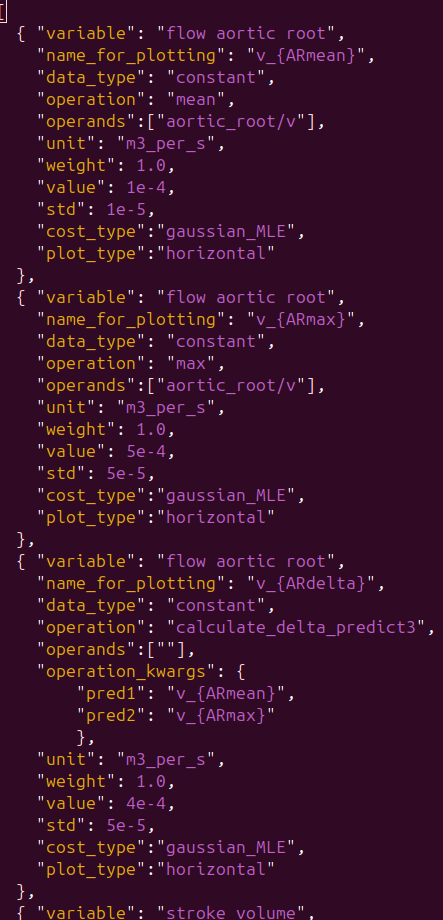
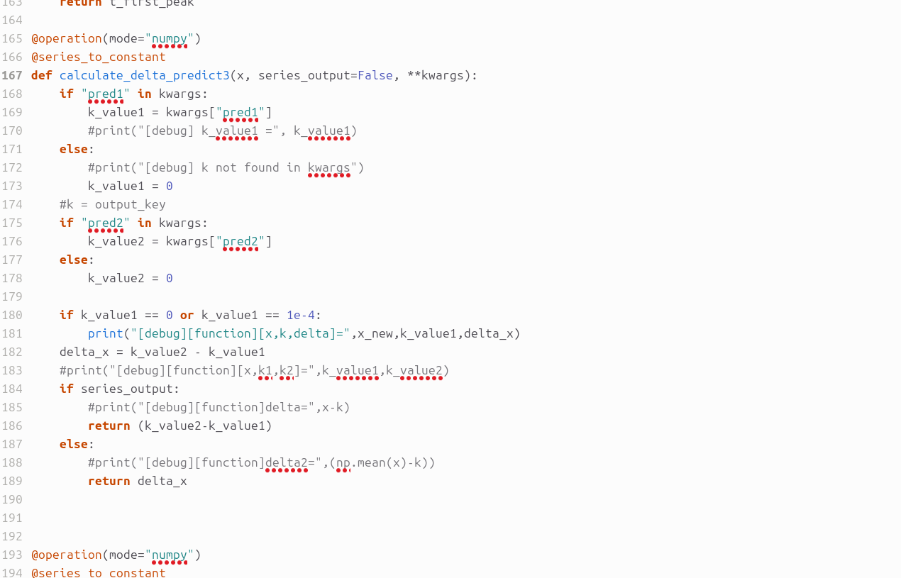

# Sensitivity Analysis

Sensitivity Analysis (SA) is a recommended first step in the calibration pipeline because it performs crucial **parameter screening**. Calibration is the process of tuning numerous model parameters (inputs) until the model's output matches experimental data. Without SA, a modeler might waste weeks tuning parameters that have virtually no impact on the final result, or unknowingly tune parameters that are highly correlated, leading to non-unique solutions. SA efficiently identifies:

* **Influential parameters:** Which parameters contribute most significantly to the model's output variance.

* **Non-influential parameters:** Which parameters can be fixed or ignored, drastically simplifying the calibration space.

SA ensures that the calibration effort is focused, efficient, and physically meaningful.

## The Sobol Method

The Sobol method is a powerful, **global, variance-based** sensitivity analysis technique. Unlike local methods that only test parameter changes one at a time, the Sobol method explores the entire input space simultaneously.

* **Key Feature:** It quantifies the contribution of each individual input parameter (First-Order Index, S_i) and the contribution of parameter interactions (Second-Order, Total-Order Index, S_{Ti}) to the overall output variance.

This comprehensive approach allows modelers to understand not only which parameters are important on their own, but also how complex, synergistic interactions between two or more parameters drive the final simulation results.

## Prerequisites

- A generated model and `obs_data.json` file (see [Parameter Identification](parameter-identification.md)).
- A `params_for_id.csv` file defining parameter ranges.
- OpenCOR Python environment with MPI if running in parallel.

## SA in Circulatory_Autogen
Since Sensitivity Analysis (SA) is intertwined with parameter identification, you will need the same input files as required for parameter identification. This includes both the **`params_for_id.csv`** and the **`obs_data.json`** files. However, the exact values of the data terms in the observation file are not critical for SA itself, as you are simply exploring parameter space and variance, not matching the simulation output to observed data.

Crucially, each data item defined in your `obs_data.json` file is treated as a feature for SA, meaning you will receive a separate set of plots (one for first and total order indices, and one for second order indices) for **each** data item.

### Configuration for `user_inputs.yaml`

To run the Sobol analysis, you need to add a `sa_options` block to your `user_inputs.yaml` configuration file:
```
sa_options: 
    method: 'sobol' 
    num_samples: 1024 
    sample_type: saltelli
    output_dir: <SA_outputs_path>
```
Currently, the available options for `method` are **`'naive'`** and **`'sobol'`**. Available sample types are [**'saltelli'**]. What we call `num_samples` here is actually the `num_samples` in

`actual_num_samples = num_samples (2M+2)`

where M is the number of parameters. This means the `num_samples` that you set doesn't need to be dependent on M.

An indicator that the **sample size may be too low** is the observation of **relatively large negative values for the Sobol indices** in the results; if this occurs, increase the sample size and re-run the analysis.

If `sa_options` is omitted, defaults are applied:

- `method: sobol`
- `num_samples: 32`
- `sample_type: saltelli`
- `output_dir: sensitivity_outputs/<file_prefix>_SA_results`

## How to run SA script

First, ensure you have the required sensitivity analysis packages specified in [Getting Started](getting-started.md).

To run the script, use the following command (which utilizes **MPI for parallelized computation** on CPU):

```
./run_sensitivity_analysis.sh <NUM_CORES>
```

After successful execution, you will find the SA plots—including the first, second, and total order indices—in the directory specified by `output_dir`.

## Expected outcome

You should have Sobol index plots saved to `sa_options.output_dir`.

## Troubleshooting

- If you see errors about `params_for_id_path`, confirm your `params_for_id.csv` filename and `resources_dir`.
- If MPI errors occur, ensure `mpiexec` is available and `mpi4py` is installed in the OpenCOR Python environment.

## Introduction to Extracting New Features from Known Ground Truth

This new feature used to calculate multiple previous (sequence in JSON file) predict results (extracted from previous experiments predict results) error and make it fitting the expectation ground truth (GT) value, to observe delta_input and delta_output relationship when GT numbers are limited. This new feature also could be used in model calibration progress.

- If your ground truth is not sufficient for performing sensitivity analysis, or if you want to extract the difference between two ground truths as a new ground truth to assess a specific feature, please use this feature. For example, if there is a ground truth max_V and another ground truth min_V, you can extract delta_V = (max_V − min_V) as the new ground truth.

Below figure is an example of a JSON file.



important notice: this experimental unit must be placed after the unit from which the experimental prediction results are extracted, ensuring that the predicted outputs are available before this unit is executed.

"name_for_plotting": "v_{ARdelta}", this string is important, you need to set a different name for different experiments, otherwise cannot use this new feature, but even if you set the same name, do not report error when running calibration progress.

"operation": "calculate_delta_predict3", must select this operation function, make it receive specific index predict results and subtract subtract with specific index predict results.

"operands": "", current experimental unit calculate results by extracted predicted results, so could be set as empty.

"operation_kwargs", this data used to point which experiment predicted results need to be added, then convey the value to participate in the cost function calculation.

"v_{ARmean}" and "v_{ARmax}", important strings, specifies which experiment predicts results will be conveyed to the current experiment.

"pred1" and "pred2": in fact, these parameter saved "v_{ARmean}" and "v_{ARmax}" experiments corresponding to predicted results. (The progress reads the JSON file and retrieves the prediction results for each experiment sequentially now)

- If you extract more than 2 experimental predict results, and calculate new features by specific ways, you need to modify corresponding "operation" name, such as change "calculate_delta_predict3" to "our_new_expect_calculate_results", then need to modify './circulatory_autogen/funcs_user/operation_funcs_user.py' to added your own calculate function, be careful about the function style, the example "calculate_delta_predict3" as shown in below figure.



-Notice: sometimes will report an error similar to the following:

```
obs_series_array_all[JJ] = self.operation_funcs_dict[
                           ^^^^^^^^^^^^^^^^^^^^^^^^^^
TypeError: operation_funcs.mean() argument after ** must be a mapping, not float
```

please just change `**self.obs_info["operation_kwargs"][JJ]` to `**kwargs`.

If there is any other issue, please contact Changqing Dong, email: cdon822@aucklanduni.ac.nz. 